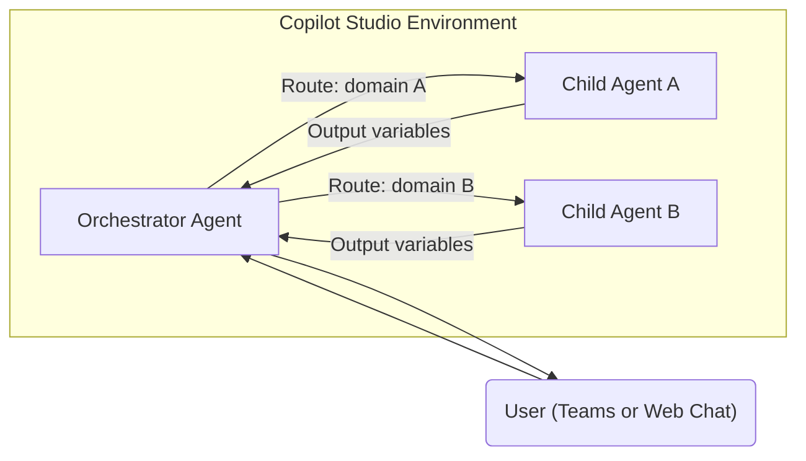
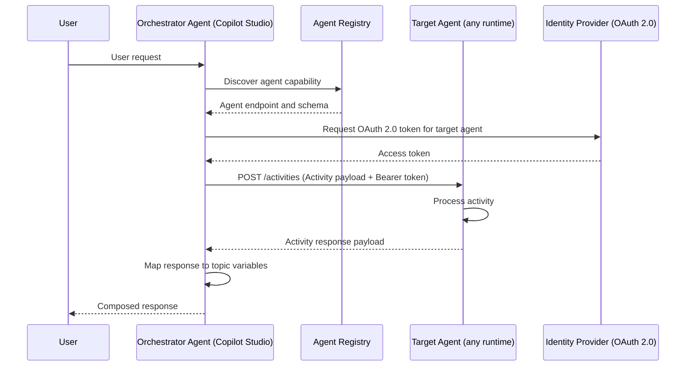
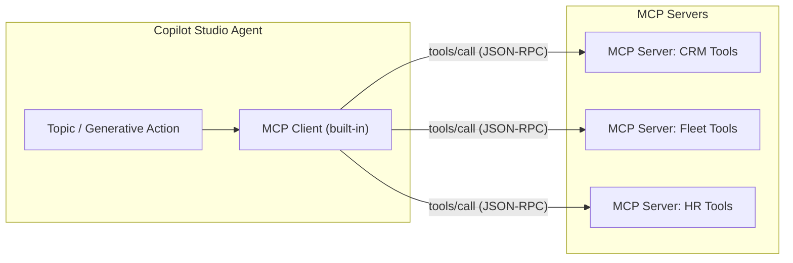
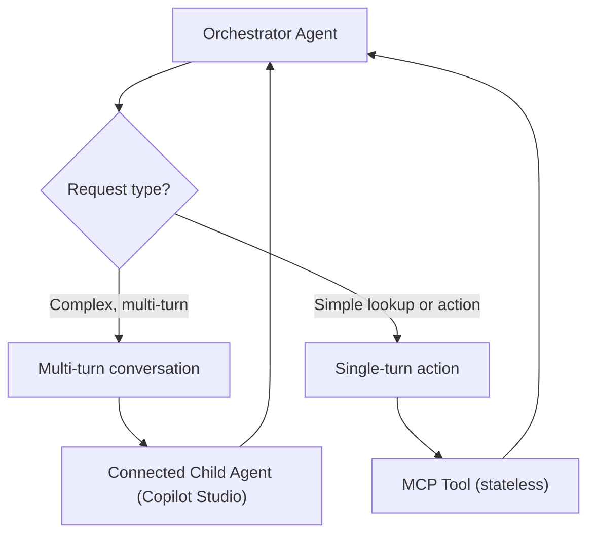
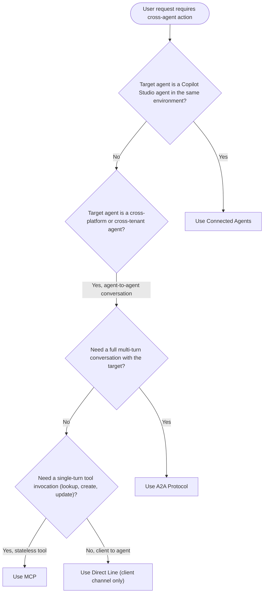

# A2A (Agent-to-Agent) Protocol Quickstart Guide

## Overview

This guide documents cross-platform agent orchestration patterns for Copilot Studio. It covers four protocols -- Connected Agents (Copilot Studio native), the A2A protocol, the Model Context Protocol (MCP), and Direct Line -- and provides a decision framework for selecting the right approach.

Use this guide when you need agents to collaborate across topic boundaries, systems, or organizational tenants.

---

## Protocol Comparison

| Protocol | Use Case | Transport | Auth | Scope |
|---|---|---|---|---|
| Connected Agents (Copilot Studio native) | Copilot Studio orchestrating another Copilot Studio agent | Internal (platform bus) | Environment-level (Entra ID) | Same tenant, same environment |
| A2A Protocol | Cross-platform agent communication (any agent runtime) | HTTP / Activity | OAuth 2.0 | Cross-platform, cross-cloud |
| MCP (Model Context Protocol) | Tool and action invocation from agent to server | JSON-RPC over HTTP/SSE | Per-server (API key or OAuth 2.0) | Tool/action invocation only |
| Direct Line | Client application or bot to Copilot Studio | REST / WebSocket | Token (Direct Line secret) | Client-to-agent channel |

---

## Connected Agents (Copilot Studio Native)

Connected agents are the first choice when both the orchestrator and the worker agent are Copilot Studio agents in the same tenant and environment. The platform handles routing, variable passing, and identity without custom code.

### Architecture



### Enabling Child Agent Connections

1. Open the orchestrator agent in Copilot Studio.
2. Go to **Settings > Generative AI > Connected agents**.
3. Select **Add connected agent**.
4. Choose the target agent from the environment agent list.
5. Assign a description to the connected agent. This description is the primary routing signal in generative orchestration mode -- write it as a clear statement of the agent's specialty.
6. Save and publish the orchestrator.

### Orchestrator Routing Configuration

Routing to connected agents is controlled by the orchestrator's generative orchestration mode. The orchestrator evaluates the user's intent against all connected agent descriptions and selects the best match.

Best practices for routing:

- Write each connected agent description as a single sentence that captures its domain precisely.
- Avoid overlapping descriptions between agents -- ambiguity causes misrouting.
- Use the test canvas to verify routing with representative phrases from each domain.
- Set fallback behavior in the orchestrator system prompt for unroutable requests.

Example orchestrator configuration fragment (YAML):

```yaml
agentName: Operations Orchestrator
description: Routes operational requests to specialized agents for coffee operations, HR policy, and IT support.
connectedAgents:
  - name: CoffeeVirtualCoach
    description: Handles all coffee recipe, beverage allergen, and brewing procedure questions.
  - name: HRPolicyAgent
    description: Answers employee questions about HR policy, leave entitlements, and onboarding.
  - name: ITHelpDeskAgent
    description: Resolves IT support requests including password resets, hardware, and software issues.
```

### Input and Output Variable Passing

Variables flow between parent and child agents through the connected agent action node:

- **Input variables**: the orchestrator maps values from its topic context into named inputs before calling the child agent.
- **Output variables**: the child agent returns named output values that the orchestrator can store and use in subsequent steps.

Example action node mapping (YAML):

```yaml
- kind: InvokeConnectedAgent
  id: invoke_it_helpdesk
  agent: ITHelpDeskAgent
  input:
    userUpn: =System.User.PrincipalName
    requestType: =Topic.RequestType
    deviceId: =Topic.DeviceId
  output:
    ticketNumber: Topic.TicketNumber
    resolutionStatus: Topic.ResolutionStatus
```

### Limitations

| Limitation | Detail |
|---|---|
| Same environment | Connected agents must reside in the same Power Platform environment. |
| Same tenant | Cross-tenant agent connections are not supported natively. |
| No external runtimes | The target agent must be a Copilot Studio agent. Azure Bot Service bots, M365 Agents SDK agents, or third-party agents require A2A or Direct Line. |
| Topic depth | Recursive agent chains beyond two or three hops increase latency and complicate debugging. |

---

## A2A Protocol

The A2A protocol enables communication between agents that are built on different runtimes -- for example, a Copilot Studio orchestrator delegating to an M365 Agents SDK agent, an Azure Bot Service bot, or a third-party agent endpoint. A2A is the correct choice when you need cross-platform, cross-cloud, or cross-tenant agent collaboration.

### Architecture



### Activity Schema

A2A communication is based on the Activity schema. Each message is a structured activity object.

Minimum required fields for an agent-to-agent request:

```json
{
  "type": "message",
  "id": "activity-id-001",
  "timestamp": "2026-03-02T12:00:00Z",
  "from": {
    "id": "orchestrator-agent-id",
    "name": "OperationsOrchestrator"
  },
  "recipient": {
    "id": "target-agent-id",
    "name": "ITHelpDeskAgent"
  },
  "conversation": {
    "id": "session-correlation-id",
    "isGroup": false
  },
  "channelId": "a2a",
  "locale": "en-US",
  "text": "Reset password for user john.doe@contoso.com",
  "value": {
    "userUpn": "john.doe@contoso.com",
    "requestType": "passwordReset"
  }
}
```

Activity type values:

| Type | Purpose |
|---|---|
| `message` | Natural language or structured request to the target agent |
| `event` | Trigger a named event in the target agent without a user message |
| `invoke` | Synchronous operation call with an expected typed response |
| `endOfConversation` | Signal conversation end, release session state |
| `typing` | Indicate processing in progress (for streaming scenarios) |

### Discovery and Registration

Agents that accept A2A connections publish a well-known endpoint and capability manifest. The orchestrator uses this manifest to determine which agent to route to and what inputs are required.

Example capability manifest (YAML):

```yaml
agentId: it-helpdesk-agent-prod
displayName: IT Help Desk Agent
description: Resolves IT support requests including password resets, hardware requests, and software access.
endpoint: https://agents.contoso.com/it-helpdesk/api/messages
supportedActivityTypes:
  - message
  - invoke
authScheme: oauth2
audience: api://it-helpdesk-agent
requiredInputs:
  - name: userUpn
    type: string
    required: true
  - name: requestType
    type: string
    required: false
outputSchema:
  - name: ticketNumber
    type: string
  - name: resolutionStatus
    type: string
```

Maintain a registry (Dataverse table or static configuration) that maps capability descriptions to endpoints. Update the registry as agents are promoted or decommissioned.

### Request and Response Patterns

#### Synchronous request-response

Use synchronous A2A for short-duration operations where the caller can await an immediate reply:

```text
Orchestrator -> POST /activities -> Target Agent
Target Agent -> 200 OK with Activity response body
Orchestrator -> Map response fields -> Continue topic
```

Timeout guidance: set HTTP timeout to 30 seconds for synchronous A2A. On timeout, retry once after a brief delay. If the retry also times out, dead-letter the request and surface an error to the user.

#### Asynchronous with callback

Use asynchronous A2A for long-running operations (document processing, multi-step workflows):

```text
Orchestrator -> POST /activities (serviceUrl set to callback endpoint)
Target Agent -> 202 Accepted (processing begins)
Target Agent -> POST to serviceUrl (completion event)
Orchestrator -> Receive completion event -> Resume topic
```

#### Invoke (typed operations)

Use `invoke` activities for typed, schema-bound operations that behave like RPC calls:

```json
{
  "type": "invoke",
  "name": "ticketing/createTicket",
  "value": {
    "userUpn": "john.doe@contoso.com",
    "priority": "high",
    "description": "Laptop screen flickering"
  }
}
```

### Error Handling and Timeout Management

| Error Class | HTTP Status | Recommended Handling |
|---|---|---|
| Invalid request | 400 | Log payload schema mismatch, do not retry, surface error to orchestrator |
| Unauthorized | 401 | Refresh OAuth token once; if still 401, fail and alert operations |
| Forbidden | 403 | Permissions issue; do not retry, raise to platform team |
| Not found | 404 | Agent endpoint misconfigured; check registry, raise routing error |
| Rate limited | 429 | Respect Retry-After header, apply exponential backoff |
| Server error | 500, 503 | Retry with backoff (3 attempts max), dead-letter on repeated failure |
| Timeout | -- | Retry once after brief delay, then dead-letter |

Error handling sketch:

```yaml
- kind: InvokeHTTP
  id: a2a_request
  method: POST
  url: =Topic.TargetAgentEndpoint
  headers:
    Authorization: =concat("Bearer ", Topic.AgentAccessToken)
    Content-Type: application/json
  body: =Topic.ActivityPayload
  successCodes: [200, 201, 202]
  onError:
    - kind: SetVariable
      variable: Topic.A2AErrorCode
      value: =System.HTTPStatusCode
    - kind: SendMessage
      message: The connected service is temporarily unavailable. Your request has been logged.
```

### Security Considerations

1. **OAuth 2.0 token acquisition**: the orchestrator must obtain a short-lived access token scoped to the target agent's audience before each A2A call. Do not cache tokens beyond their expiry.

2. **Audience restriction**: each target agent must validate the `aud` claim in the incoming token. Reject requests where `aud` does not match the agent's registered identifier.

3. **Transport security**: all A2A calls must use HTTPS. Reject or log requests received over plain HTTP.

4. **Message integrity**: use `id` and `timestamp` fields for idempotency checks. Duplicate activity IDs should be deduplicated at the receiver.

5. **Input validation**: validate all `value` fields against the declared input schema before processing. Reject activities with unexpected or malformed fields.

6. **Conversation scope isolation**: do not allow state from one conversation to leak into another. Scope all session variables to `conversation.id`.

7. **DLP boundary enforcement**: before invoking a cross-tenant A2A endpoint, verify that the payload does not contain data subject to DLP restrictions in the originating environment.

Token acquisition example (Power Automate HTTP action):

Note: `ClientId` and `ClientSecret` in the example below represent values retrieved at runtime from Azure Key Vault or Power Platform environment secrets. Do not store credentials as plain-text variables or hardcode them in flow definitions.

```json
{
  "method": "POST",
  "uri": "https://login.microsoftonline.com/@{variables('TenantId')}/oauth2/v2.0/token",
  "headers": {
    "Content-Type": "application/x-www-form-urlencoded"
  },
  "body": "grant_type=client_credentials&client_id=@{variables('ClientId')}&client_secret=@{variables('ClientSecret')}&scope=api://it-helpdesk-agent/.default"
}
```

---

## MCP (Model Context Protocol) for Agent Communication

MCP provides a standardized JSON-RPC interface for agents to invoke tools and actions hosted on MCP servers. Where A2A is agent-to-agent conversation, MCP is agent-to-tool invocation.

### Architecture



### Using MCP Servers as Agent Backends

An MCP server exposes a set of tools that the agent can discover and invoke. Each tool has a name, description, and input schema. The agent selects tools based on semantic matching of the user's intent to the tool descriptions.

To register an MCP server in Copilot Studio:

1. Open the target agent in Copilot Studio.
2. Go to **Actions > Add an action > Model Context Protocol**.
3. Enter the MCP server URL (HTTPS endpoint).
4. Configure authentication (API key or OAuth 2.0 as required by the server).
5. Copilot Studio fetches the server's tool manifest and registers all available tools.
6. Save and test tool invocations from the test canvas.

Example MCP tool manifest response:

```json
{
  "tools": [
    {
      "name": "create_service_ticket",
      "description": "Creates a new IT service ticket for the specified user and issue type.",
      "inputSchema": {
        "type": "object",
        "properties": {
          "userUpn": { "type": "string", "description": "User principal name of the requestor" },
          "issueType": { "type": "string", "description": "Category of the issue (hardware, software, access)" },
          "description": { "type": "string", "description": "Detailed description of the issue" }
        },
        "required": ["userUpn", "issueType", "description"]
      }
    },
    {
      "name": "get_ticket_status",
      "description": "Retrieves the current status and resolution notes for an existing service ticket.",
      "inputSchema": {
        "type": "object",
        "properties": {
          "ticketId": { "type": "string", "description": "Service ticket identifier" }
        },
        "required": ["ticketId"]
      }
    }
  ]
}
```

### Tool Routing and Semantic Selection

In generative orchestration mode, the agent selects which MCP tool to invoke based on the semantic match between the user's request and the tool's description field. Write tool descriptions as precise, action-oriented statements:

- Good: "Creates a new IT service ticket for the specified user and issue type."
- Avoid: "Tool for tickets."

When multiple tools have similar descriptions, add disambiguation context. For example:

- "Retrieves the status of an existing service ticket by ticket ID." (distinct from creating)
- "Creates a new service ticket. Use this when the user is reporting a new problem." (disambiguation hint)

### Combining MCP with Connected Agents

MCP and connected agents can be used in the same orchestrator:

- Use connected agents for routing to full Copilot Studio agents that handle multi-turn conversations.
- Use MCP tools for single-turn, stateless action invocations (lookups, creates, updates).



### MCP Authentication Patterns

| Auth Method | When to Use |
|---|---|
| API key (header) | Simple server-to-server tools with no user identity context |
| OAuth 2.0 client credentials | Server-to-server tools requiring audience-scoped tokens |
| OAuth 2.0 authorization code | Tools that act on behalf of the signed-in user |

Always store MCP server credentials as environment secrets. Do not hardcode keys in agent configurations.

---

## Decision Guide

### Choosing the Right Protocol

Use the following decision tree to select the appropriate protocol:



### Detailed Comparison

| Dimension | Connected Agents | A2A Protocol | MCP | Direct Line |
|---|---|---|---|---|
| Target runtime | Copilot Studio only | Any agent runtime | Any MCP server | Any bot/agent endpoint |
| Conversation state | Managed by platform | Managed by activity correlation | Stateless per call | Managed by channel |
| Multi-turn support | Yes | Yes | No (single invocation) | Yes |
| Cross-tenant | No | Yes | Yes | Yes |
| Cross-cloud | No | Yes | Yes | Yes |
| Auth mechanism | Environment-level Entra ID | OAuth 2.0 | Per-server (API key or OAuth 2.0) | Direct Line token |
| Setup complexity | Low | Medium to High | Low to Medium | Medium |
| Latency overhead | Lowest (platform-internal) | Medium (HTTP round-trip) | Low (HTTP round-trip) | Medium (REST/WebSocket) |
| Suitable for orchestration | Yes | Yes | Tool invocation only | No (client channel) |

### When to Use Connected Agents

- Both agents are Copilot Studio agents in the same Power Platform environment.
- The orchestration pattern is straightforward parent-to-child routing.
- You want zero custom code and platform-managed variable passing.
- All agents share the same tenant identity and compliance boundary.

### When to Use A2A Protocol

- One or more agents run outside Copilot Studio (M365 Agents SDK, Azure Bot Service, third-party).
- The collaboration pattern is cross-tenant or cross-cloud.
- You need a platform-neutral, standard protocol for multi-runtime orchestration.
- The interaction requires multi-turn state management with a non-Copilot-Studio agent.

### When to Use MCP

- The target functionality is a stateless tool or action, not a conversational agent.
- You want to expose tools to multiple agents from a single server.
- The tool server is shared with non-Copilot-Studio consumers (for example, Azure AI Foundry agents, GitHub Copilot extensions).
- You prefer a lightweight JSON-RPC integration without Activity schema overhead.

### When to Use Direct Line

- A custom client application (mobile app, web app, custom UI) needs to connect to a Copilot Studio agent.
- You are building a bot-to-bot integration where the source side is an Azure Bot Service bot acting as a client.
- You need WebSocket-based streaming responses.

### Performance and Latency Tradeoffs

| Protocol | Typical Additional Latency | Notes |
|---|---|---|
| Connected Agents | Near-zero (platform-internal routing) | Fastest option; no external HTTP call |
| A2A Protocol | 100 to 500 ms per hop | Includes token acquisition, HTTPS handshake, and target processing |
| MCP | 50 to 300 ms per tool call | Token acquisition amortized if reused; depends on tool complexity |
| Direct Line | 100 to 400 ms | WebSocket keeps connection warm; first message includes channel setup |

For latency-sensitive conversational flows, prefer connected agents. For cross-platform integrations where small latency costs are acceptable, A2A and MCP are appropriate choices.

### Security and Isolation Requirements

| Requirement | Recommended Protocol |
|---|---|
| Same-tenant, same-environment isolation | Connected Agents |
| Cross-tenant isolation with OAuth 2.0 scoping | A2A Protocol |
| Tool-level DLP and secret isolation | MCP with per-server credentials |
| External client isolation (public-facing) | Direct Line with token refresh |
| Zero-trust, per-call token validation | A2A Protocol |

### Cross-Tenant and Cross-Cloud Scenarios

For cross-tenant scenarios, use A2A with the following controls:

1. Register the target agent in an agent registry accessible to the orchestrating tenant.
2. Use separate Entra ID app registrations per tenant with distinct `aud` claims.
3. Enforce conditional access policies on the token endpoints for both tenants.
4. Validate the `tid` (tenant ID) claim in the incoming token at the target agent.
5. Scope data returned in A2A responses to the minimum required for the requesting agent.

For cross-cloud scenarios (for example, Microsoft Azure to AWS or GCP), use A2A over public HTTPS endpoints with mutual TLS or OAuth 2.0 client credentials flow. MCP is also viable for tool-level cross-cloud integrations.

---

## Implementation Checklist

| Control | Connected Agents | A2A Protocol | MCP |
|---|---|---|---|
| Agent registration | Configure in Copilot Studio UI | Publish capability manifest to registry | Register server URL in agent actions |
| Authentication | Environment-level (automatic) | OAuth 2.0 token per call | API key or OAuth 2.0 per server |
| Variable mapping | Input/output node in topic | Activity `value` fields | Tool input/output schema |
| Error handling | Platform-managed fallback | Custom error branch with status codes | Custom error branch |
| Timeout | Platform default | Set HTTP timeout (30 s recommended) | Set HTTP timeout (30 s recommended) |
| Secret storage | Environment variable (if needed) | Key Vault or environment secret | Environment secret |
| Monitoring | Copilot Studio conversation analytics | Azure Monitor / Application Insights on target | Application Insights on MCP server |
| DLP validation | Automatic (same environment) | Pre-call payload review | Pre-call payload review |

---

## References

- [Copilot Studio connected agents documentation](https://learn.microsoft.com/microsoft-copilot-studio/connected-agents)
- [Microsoft 365 Agents SDK](https://learn.microsoft.com/microsoft-365/agents-sdk/overview)
- [Activity schema reference (Bot Framework)](https://learn.microsoft.com/azure/bot-service/bot-activity-handler-concept)
- [Model Context Protocol specification](https://modelcontextprotocol.io/specification)
- [Direct Line API reference](https://learn.microsoft.com/azure/bot-service/rest-api/bot-framework-rest-direct-line-3-0-concepts)
- [docs/authentication.md](authentication.md) -- authentication architecture for all verticals in this repository
- [docs/connectors.md](connectors.md) -- connector inventory and governance reference
