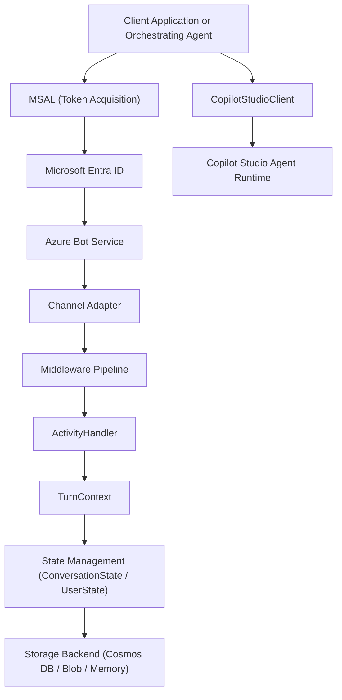

# M365 Agents SDK Architecture

## Overview

The Microsoft 365 Agents SDK provides a structured programming model for building agents that communicate with Copilot Studio and with other agents across the Microsoft 365 platform. This document describes the core SDK components, the Activity protocol used for agent-to-agent communication, the channel adapter architecture, and the end-to-end authentication flow.

## Core SDK Components

### CopilotStudioClient

`CopilotStudioClient` is the primary entry point for connecting a custom application or agent to a Copilot Studio-hosted agent. It manages the HTTP or WebSocket transport, handles session lifecycle, and provides a typed interface for sending and receiving Activity objects.

| Responsibility | Description |
|---|---|
| Session creation | Opens a conversation session against the Direct Line Speech or Direct Line REST endpoint exposed by Copilot Studio |
| Activity dispatch | Serializes outbound Activity objects and transmits them to the agent runtime |
| Response streaming | Receives streaming or batched Activity responses and surfaces them to the host application |
| Token refresh | Re-acquires bot tokens before expiry without interrupting active conversations |
| Retry coordination | Applies configurable backoff and retry logic on transient transport failures |

### ActivityHandler

`ActivityHandler` is the base class for implementing inbound activity processing in a custom agent or skill. It routes incoming Activity objects to handler methods based on activity type.

Key handler methods:

| Method | Activity type routed |
|---|---|
| `onMessage` | Message activities from users or downstream agents |
| `onConversationUpdate` | Members added, members removed events |
| `onEvent` | Named event activities used for custom signaling |
| `onInvoke` | Invoke activities from Adaptive Card submissions and other platform invocations |
| `onEndOfConversation` | Session termination signal |

### TurnContext

`TurnContext` is the per-request context object threaded through every activity handler invocation. It exposes:

- The inbound Activity
- The adapter reference for sending replies
- A key/value state property accessor for reading and writing turn-scoped data
- Telemetry client for structured logging
- A cancellation token for cooperative cancellation of async operations

### ConversationState and UserState

The SDK ships two pre-built state management containers:

- `ConversationState`: scoped to a conversation ID, surviving multiple turns within one session
- `UserState`: scoped to a channel user ID, surviving across multiple conversations

Both containers use a pluggable `Storage` interface. Supported backends include Azure Blob Storage, Azure Cosmos DB, and in-memory storage for development.

## Agent-to-Agent Communication via Activity Protocol

Agents communicate by exchanging Activity objects. An Activity is a JSON document conforming to the Bot Framework Activity schema. The fields most relevant to Copilot Studio integration are:

| Field | Description |
|---|---|
| `type` | Activity type: `message`, `event`, `invoke`, `endOfConversation`, `typing` |
| `id` | Unique activity identifier assigned by the channel |
| `timestamp` | ISO 8601 UTC timestamp of activity creation |
| `channelId` | Identifies the originating channel: `msteams`, `directline`, `webchat` |
| `from` | Identity of the sender (agent or user) |
| `recipient` | Identity of the intended receiver |
| `conversation` | Conversation reference shared by all activities in the session |
| `text` | Plain text content for message activities |
| `value` | Structured payload for invoke and event activities |
| `attachments` | Array of rich content attachments including Adaptive Cards |
| `suggestedActions` | Quick reply prompts |

### Multi-Agent Routing

When an orchestrating agent delegates work to a Copilot Studio agent, it:

1. Constructs an outbound Activity with `type: message` and the delegated user utterance or structured request in `text` or `value`.
2. Submits the Activity to the Copilot Studio session via `CopilotStudioClient`.
3. Awaits one or more response Activities from Copilot Studio.
4. Maps the response back to the calling agent's conversation context using the original `conversation` reference.

The delegating agent is responsible for correlation. It stores the originating conversation reference before the delegation call and restores it when assembling the final reply to the user.

### Event Activities for Control Signaling

Event Activities with custom `name` fields are used for out-of-band control signals between agents:

```text
type: event
name: copilot.handoff.request
value: { "agentId": "claims-assistant", "context": { ... } }
```

The receiving agent inspects `name` to dispatch to domain-specific handling logic without entering the main conversational flow.

## Channel Adapter Architecture

The channel adapter layer decouples the agent business logic from transport mechanics. Each adapter normalizes channel-specific wire formats into the canonical Activity schema.

```
Channel Wire Protocol
        |
        v
  Channel Adapter
(Teams Adapter / Direct Line Adapter / Custom Adapter)
        |
        v
  Activity Schema (normalized)
        |
        v
  ActivityHandler (agent logic)
        |
        v
  Response Activity
        |
        v
  Channel Adapter (serialize)
        |
        v
Channel Wire Protocol
```

### Teams Adapter

The Teams Adapter handles the Bot Framework v3 REST API used by Microsoft Teams. It normalizes Teams-specific Activity extensions (meeting events, tab fetch/submit invokes, messaging extension queries) into the standard Activity schema. It also handles proactive messaging by converting stored conversation references into valid Teams endpoint calls.

Configuration requires:

- Microsoft App ID (from the Bot registration in Azure)
- Microsoft App Password or certificate credential
- Teams channel registration in Azure Bot Service

### Direct Line Adapter

The Direct Line Adapter exposes a REST and WebSocket endpoint for web clients, mobile apps, and custom agents. It supports:

- Token-based client authentication via Direct Line Secret or short-lived tokens
- Activity streaming over WebSocket for low-latency responses
- Reconnection with watermark-based replay to recover missed activities

### Custom Adapters

Custom adapters implement the `BotAdapter` interface to support non-standard channels such as SMS gateways, telephony platforms, or proprietary enterprise messaging systems. The adapter must:

1. Parse the inbound channel payload into an Activity.
2. Call `processActivity` on the adapter base to route through the middleware pipeline and into the ActivityHandler.
3. Implement `sendActivities` to serialize and transmit outbound activities to the channel.
4. Implement `updateActivity` and `deleteActivity` if the channel supports message mutation.

## Authentication Flow

The full authentication chain from a client application to a Copilot Studio agent involves four stages:

```
Client Application
       |
       | MSAL token acquisition (client credentials or OBO)
       v
Microsoft Entra ID (formerly Azure AD)
       |
       | Entra ID issues access token for Bot Service audience
       v
Azure Bot Service Token Exchange
       |
       | Bot Service validates Entra token, issues bot-specific token
       v
Copilot Studio Agent Runtime
       |
       | Agent validates bot token, establishes conversation session
       v
Authorized Agent Session
```

### Stage 1: MSAL Token Acquisition

The client (or orchestrating agent) uses Microsoft Authentication Library (MSAL) to acquire an access token for the Bot Service audience: `https://api.botframework.com`.

For service-to-service (daemon) scenarios, the client credentials grant is used with the application's Entra ID app registration:

```text
POST https://login.microsoftonline.com/{tenantId}/oauth2/v2.0/token
Content-Type: application/x-www-form-urlencoded

grant_type=client_credentials
&client_id={appId}
&client_secret={appSecret}
&scope=https://api.botframework.com/.default
```

For user-delegated scenarios, the On-Behalf-Of (OBO) flow propagates the user's identity through the service chain.

### Stage 2: Entra ID Token Issuance

Entra ID validates the request and issues a bearer token scoped to the Bot Service audience. The token contains the application's object ID, tenant ID, and any configured application roles.

### Stage 3: Bot Service Token Exchange

The Azure Bot Service validates the bearer token presented by the client against the registered application credentials. On success, it issues a channel-specific authentication context that the Copilot Studio runtime trusts.

### Stage 4: Copilot Studio Session Authorization

Copilot Studio validates the channel token and creates an authorized conversation session. If the agent is configured with Azure AD authentication, the user identity context is also established at this stage via SSO or an explicit sign-in card flow.

## SDK Component Dependency Diagram



## Summary

| Component | Role |
|---|---|
| CopilotStudioClient | Connects custom apps and agents to Copilot Studio sessions |
| ActivityHandler | Routes inbound activities to domain handler methods |
| TurnContext | Per-turn request context and reply surface |
| Channel Adapter | Normalizes channel-specific wire protocols to Activity schema |
| MSAL | Acquires Entra ID tokens for Bot Service authentication |
| Azure Bot Service | Validates credentials and brokers channel access |
| Copilot Studio Runtime | Executes agent topics, knowledge retrieval, and action orchestration |
