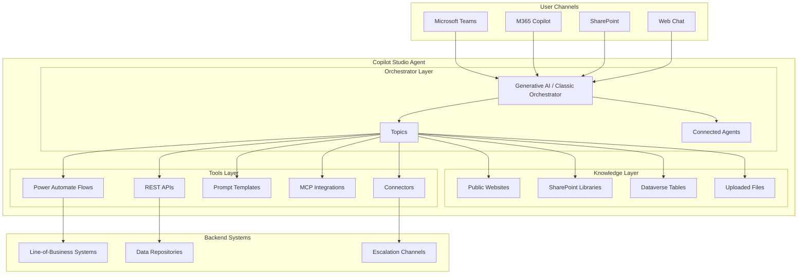
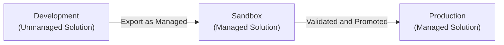
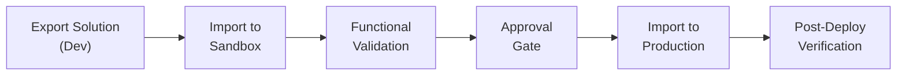
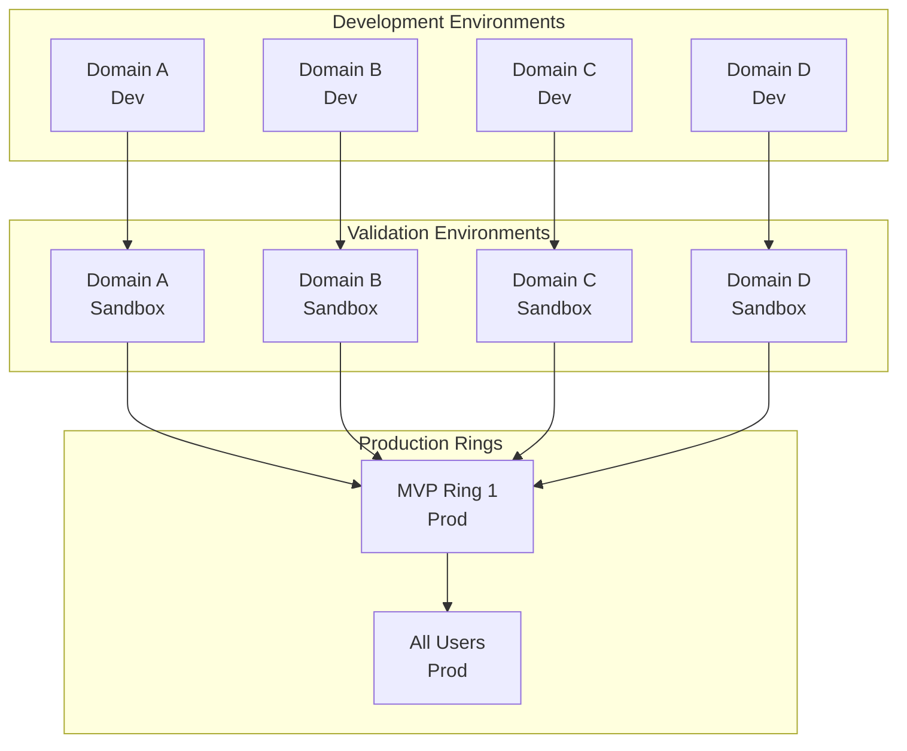

# Agent Configuration Guide

A cross-cutting reference for creating, configuring, and managing Copilot Studio agents across all verticals in this repository. This guide extracts the universal methodology from agent-specific configurations and presents it as the definitive blueprint applicable to every agent -- Coffee, Clothing, Insurance, Tech, Transportation, or any new vertical.

---

## Table of Contents

1. [Overview](#1-overview)
2. [Agent Architecture Layers](#2-agent-architecture-layers)
3. [Use Case Definition Template](#3-use-case-definition-template)
4. [Agent Creation in Copilot Studio](#4-agent-creation-in-copilot-studio)
5. [Instructions Design](#5-instructions-design)
6. [Knowledge Source Configuration](#6-knowledge-source-configuration)
7. [Publishing and Polishing](#7-publishing-and-polishing)
8. [Agent Lifecycle Management](#8-agent-lifecycle-management-alm)
9. [Browser Automation Runbooks](#9-browser-automation-runbooks)
10. [References](#10-references)

---

## 1. Overview

### Purpose

This document is the end-to-end guide for building any Copilot Studio agent in this repository. It covers architecture, configuration, knowledge sources, publishing, lifecycle management, and browser automation. Every agent-specific config guide should be a specialization of this universal guide, not a standalone document.

### Scope

This guide applies to all verticals and agent types:

| Vertical | Example Agents |
|----------|---------------|
| Coffee | Barista Advisor, Store Operations Bot |
| Clothing | Retail Associate Agent, Inventory Advisor |
| Insurance | Policy Advisor, Claims Assistant |
| Tech | IT Help Desk, Support Bot |
| Transportation | Fleet Manager, Dispatch Advisor |

New verticals follow the same patterns documented here.

### Prerequisites

| Requirement | Details |
|-------------|---------|
| Microsoft 365 License | Required for Teams, SharePoint, and M365 Copilot channels |
| Copilot Studio License | Required for agent creation, publishing, and generative AI features |
| Power Platform License | Required for Dataverse, Power Automate flows, and solution management |
| Environment Access | At minimum, a Development environment with the Copilot Studio Maker role |

---

## 2. Agent Architecture Layers

Every Copilot Studio agent follows a three-layer architecture. The layers are the same regardless of vertical or use case.



### Orchestrator Layer

The orchestrator manages conversation flow, routes user intent, and coordinates responses. Two modes are available:

| Mode | Description | When to Use |
|------|-------------|-------------|
| Generative AI | LLM-driven orchestration using instructions and knowledge | Agents with broad, open-ended queries |
| Classic | Topic-based routing with trigger phrases and entity extraction | Agents with well-defined, structured workflows |

Most agents use **Classic and Generative** mode combined, allowing structured topics alongside generative fallback.

**Topics** define conversation paths for specific intents. **Connected Agents** allow delegation to specialized sub-agents when multi-domain expertise is required.

### Knowledge Layer

The knowledge layer provides the information foundation. All grounded responses draw from these sources.

| Source Type | Description |
|-------------|-------------|
| Public Websites | Externally accessible pages (corporate site, product docs, regulatory portals) |
| SharePoint Libraries | Internal document libraries (policies, handbooks, SOPs, guides) |
| Dataverse Tables | Structured data (FAQ records, metadata, configuration tables) |
| Uploaded Files | Static documents (PDF, Word) uploaded directly to the agent |

### Tools Layer

Tools extend the agent beyond knowledge retrieval into action.

| Tool | Purpose |
|------|---------|
| Connectors | Connect to external systems (CRM, ERP, ITSM) |
| Power Automate Flows | Trigger workflows (notifications, approvals, form submissions) |
| Prompt Templates | Custom prompt patterns for specialized reasoning |
| MCP | Model Context Protocol for advanced tool integrations |
| REST APIs | Direct API calls to backend services |

---

## 3. Use Case Definition Template

Before building any agent, complete this template to define scope and requirements. This is the first artifact produced during agent planning.

### Blank Template

| Field | Value |
|-------|-------|
| **Knowledge and Data Sources** | _List all knowledge sources: websites, SharePoint sites, Dataverse tables, uploaded files_ |
| **Topics** | _List the conversation topics the agent must handle_ |
| **Restrictions / Requirements** | _Access restrictions, compliance requirements, data residency, audience scope_ |
| **Instructions** | _Link to or summarize the instruction set (see Section 5)_ |
| **Tools and Agents** | _Connectors, flows, prompts, MCP integrations, connected agents_ |
| **Environment and Channels** | _Target environment(s) and publishing channels (Teams, M365, SharePoint, Web)_ |
| **Actions / Flows / Triggers** | _Power Automate flows, scheduled triggers, event-driven actions_ |
| **Analytics and Evaluations** | _KPIs, evaluation criteria, conversation analytics configuration_ |

### Guidance for Each Field

| Field | What to Include |
|-------|----------------|
| Knowledge and Data Sources | Be specific. List URLs, site names, table names. Distinguish between primary and supplemental sources. |
| Topics | Name each topic and include 3-5 example trigger phrases per topic. |
| Restrictions / Requirements | State who can access the agent, any data classification constraints, and regulatory obligations. |
| Instructions | Reference the instruction design pattern in Section 5. Link to the agent-specific instruction block. |
| Tools and Agents | List each tool with its purpose. For connected agents, name the agent and describe the handoff trigger. |
| Environment and Channels | Specify the Dev/Sandbox/Prod environments and which channels are enabled at each stage. |
| Actions / Flows / Triggers | Describe each flow: trigger condition, input parameters, expected output, error handling. |
| Analytics and Evaluations | Define success metrics (resolution rate, user satisfaction, escalation rate) and evaluation cadence. |

---

## 4. Agent Creation in Copilot Studio

### Step 1: Access Copilot Studio

1. Navigate to [https://copilotstudio.microsoft.com](https://copilotstudio.microsoft.com).
2. Select the target Dataverse environment (use the Development environment for initial builds).
3. Confirm your account has the **Copilot Studio Maker** role.

### Step 2: Create a New Agent

1. Click **Create** from the left navigation.
2. Select the **Agent** tab.
3. Describe your use case in the natural language prompt. Copilot Studio generates a scaffold based on your description.
4. Review the generated scaffold: topics, instructions, and suggested knowledge sources.
5. Accept or modify the scaffold before proceeding.

### Step 3: Configure Agent Details

| Setting | Description |
|---------|-------------|
| Name | Display name shown to users across all channels |
| Description | Internal description for administrators and makers |
| Language | Primary language for the agent |
| Icon | Visual identifier (see publishing checklist in Section 7) |

### Step 4: Select the Model

1. Navigate to **Settings** > **Generative AI**.
2. Select the target model.

| Model | Characteristics | Recommended For |
|-------|----------------|-----------------|
| GPT-4o | Fast, cost-effective, strong general reasoning | Most production agents |
| GPT-5 Chat | Advanced reasoning, improved instruction following | Agents requiring complex multi-step logic |

3. Enable **Classic and Generative** mode to support both structured topics and generative answers.

### Step 5: Set Instructions

1. Navigate to the agent overview page.
2. Paste the instruction block (see Section 5) into the **Instructions** field.
3. Save and test with sample queries to validate behavior.

### Step 6: Add Knowledge Sources

Follow the knowledge configuration steps in Section 6.

### Step 7: Define Topics

1. Create topics as defined in the use case template.
2. Configure trigger phrases, entity extraction, and response templates for each topic.
3. Test each topic individually before enabling generative orchestration.

NOTE: For automated agent setup, refer to the browser automation runbook in the agent-specific folder. See Section 9 for the runbook pattern.

---

## 5. Instructions Design

Instructions are the behavioral contract between you and the agent. They define what the agent does, how it responds, and when it escalates.

### The Micro-Stepping Pattern

Every agent's instructions should follow this structure:

```
# Purpose
[What the agent does and who it serves]

# General Guidelines
[Tone, style, citation requirements, behavioral constraints]

# Skills
[Capabilities the agent has: search, summarize, calculate, route, etc.]

# Step-by-Step Instructions

## 1. [First Step Name]
- Goal: [What this step accomplishes]
- Action: [Specific behavior the agent performs]
- Transition: [How the agent moves to the next step]

## 2. [Second Step Name]
- Goal: ...
- Action: ...
- Transition: ...

[Continue for all steps]

# Error Handling and Limitations
[What the agent does when it cannot find an answer or encounters ambiguity]

# Feedback and Iteration
[How the agent confirms resolution and offers follow-up assistance]

# Interaction Example
[At least one concrete input/output example]
```

### Micro-Step Components

Each numbered step has three components:

| Component | Purpose |
|-----------|---------|
| Goal | What this step aims to accomplish |
| Action | The specific behavior the agent performs |
| Transition | How the agent moves to the next step |

This pattern produces consistent, predictable agent behavior and makes debugging straightforward. When an agent misbehaves, you can identify exactly which step diverged.

### Best Practices for Writing Instructions

1. **Be explicit about tone.** State the expected communication style: professional, supportive, formal, casual.
2. **Define the search-first pattern.** Instruct the agent to search knowledge sources before generating answers from its training data.
3. **Require citations.** Mandate that every answer grounded in knowledge includes a source reference.
4. **Handle uncertainty gracefully.** Include explicit fallback behavior when no relevant information is found.
5. **Include interaction examples.** Provide at least one concrete example of the expected input/output pattern.
6. **Use structured steps.** Break complex workflows into numbered, sequential steps with Goal/Action/Transition.
7. **Define escalation paths.** Specify when and how the agent should hand off to a human or connected agent.
8. **Iterate based on testing.** V1 instructions are a starting point. Refine based on user testing, analytics, and evaluation results.

### Example Interaction Pattern

```
User: "[Typical user question for your domain]"
Agent: "[Expected response format with summary, citation, and next steps]"
```

Every agent-specific instruction set should include at least one domain-relevant example following this pattern.

---

## 6. Knowledge Source Configuration

### Source Types

| Type | When to Use |
|------|-------------|
| Public Websites | Content is externally accessible and regularly updated by the source organization |
| SharePoint Libraries | Internal documents that require M365 authentication |
| Dataverse Tables | Structured, queryable data (FAQs, metadata, lookup tables) |
| Uploaded Files | Static documents (PDF, Word) that do not change frequently |

### Adding a Knowledge Source

1. Open the agent in Copilot Studio.
2. Navigate to **Knowledge** > **Add knowledge source**.
3. Select the source type.
4. Enter the URL, site reference, or upload the file.
5. Write a meaningful description (see below).
6. Save and run a manual sync.
7. Test with a sample query to verify retrieval quality.

### Description Best Practices

CRITICAL: Write meaningful descriptions for every knowledge source. The orchestrator uses these descriptions to decide which source to query. Auto-generated descriptions reduce retrieval accuracy.

| Practice | Example |
|----------|---------|
| Describe the content domain | "HR policies covering employee lifecycle from onboarding to separation" |
| Specify the document types | "PDF and Word documents including handbooks, guides, and policy memos" |
| Note the audience | "Policies applicable to all full-time and part-time employees" |
| Avoid auto-generated text | Do not accept default descriptions; always write your own |
| Keep it concise but specific | 1-3 sentences that clearly scope the content |

A good description tells the orchestrator: what kind of information lives in this source, what topics it covers, and who it serves.

### Web Search

| Setting | Guidance |
|---------|----------|
| When to Enable | Enable when the agent needs supplemental context beyond internal knowledge (regulatory references, industry standards, public documentation) |
| When to Disable | Disable when all required knowledge is internal and web results would introduce noise or risk |

WARNING: Web search should supplement, not replace, internal knowledge sources. Internal documents are always the authoritative source for organizational policy and process.

### Validation

After adding each knowledge source:

1. Run 3-5 test queries that should return results from that source.
2. Verify the agent cites the correct source in its response.
3. Check for retrieval gaps: queries that should match but return no results.
4. Adjust the description or source scope if retrieval quality is poor.

### Start Small

Start with 2 knowledge sources. Validate the retrieval pipeline end to end. Analyze the results. Then add sources incrementally. Adding too many sources at once makes it difficult to diagnose retrieval issues.

---

## 7. Publishing and Polishing

### Pre-Publish Checklist

Complete all 10 items before publishing.

| # | Item | Requirements |
|---|------|-------------|
| 1 | **Agent Name** | Confirm the display name matches the approved agent name for your vertical |
| 2 | **Channels** | Enable the target channels: Teams, M365 Copilot, SharePoint, Web Chat |
| 3 | **Icon** | PNG format, under 30KB, white transparent background, recognizable at small sizes |
| 4 | **Color** | Set the accent color to match your organization or vertical brand guidelines |
| 5 | **Developer Name** | Enter the responsible team or individual (e.g., "Enterprise Platform Team") |
| 6 | **Website URL** | Set to your organization's website or the agent's landing page |
| 7 | **Privacy Statement URL** | Link to your organization's privacy statement |
| 8 | **Terms of Use URL** | Link to your organization's terms of use for internal tools |
| 9 | **Short Description** | Up to 80 characters. Concise, action-oriented summary for the agent card |
| 10 | **Long Description** | 3-5 sentences explaining capabilities, supported topics, and usage instructions |

### Channel-Specific Configuration

#### Microsoft Teams

1. Complete the pre-publish checklist.
2. Navigate to **Publish** in Copilot Studio.
3. Review the publish summary for warnings or errors.
4. Click **Publish**.
5. Submit for admin approval if required by your tenant policy.
6. Verify the agent appears in the Teams app catalog after approval.

#### M365 Copilot

1. Publish the agent from Copilot Studio.
2. Verify the agent appears in the Copilot extensions gallery.
3. Confirm users can invoke the agent from the M365 Copilot interface.

#### SharePoint

1. Publish the agent from Copilot Studio.
2. Embed the agent web chat component on the target SharePoint page(s).
3. Test the embedded experience in the target site context.

#### Web Chat

1. Publish the agent from Copilot Studio.
2. Copy the embed code from the Channels configuration.
3. Deploy the embed code to the target web application.
4. Test authentication and conversation flow in the embedded context.

---

## 8. Agent Lifecycle Management (ALM)

### Three-Environment Pattern

Every agent follows a three-environment promotion model. No exceptions.



#### Environment Details

| Environment | Solution Type | Editing | Purpose | Access |
|-------------|--------------|---------|---------|--------|
| Development | Unmanaged | Multiple authors can edit | Active development, topic authoring, knowledge tuning, rapid iteration | Agent makers and developers |
| Sandbox | Managed | No solution editing allowed | Functional validation, integration testing, UAT | Minimal user access for testing |
| Production | Managed | No editing, Managed Environment enabled | Production deployment, DLP restrictions, least-privileged roles | Target user population |

### Solution Naming Conventions

| Attribute | Convention | Example |
|-----------|-----------|---------|
| Solution Name | PascalCase, no spaces, vertical prefix optional | PolicyAdvisor, CoffeeBarista, ITHelpDesk |
| Version | Major.Minor.Build.Revision | 1.0.0.1 |
| Publisher | Team or organization name | Enterprise Platform Team |

### Build Pipeline Configuration

Configure the build pipeline through the Copilot Studio solutions page.

| Stage | Action | Validation |
|-------|--------|------------|
| Export from Dev | Export the solution as managed | Solution checker passes with no critical errors |
| Import to Sandbox | Import the managed solution into Sandbox | All components import successfully |
| Functional Validation | Execute test scenarios against the Sandbox agent | All test cases pass |
| Approval Gate | Obtain sign-off from the agent owner or stakeholder | Approval documented |
| Promote to Production | Import the managed solution into Production | Smoke tests pass |
| Post-Deployment | Verify agent availability on all channels | End-to-end user flow confirmed |

### Deployment Stages



### Environment Topology

For organizations managing multiple agent domains, use a domain-specific environment topology with staged production rings.



Each domain team (HR, Legal, Operations, IT, etc.) develops and validates independently. Production uses a ring-based rollout: MVP Ring 1 for early adopters, then All Users after validation.

### Governance Controls

Production environments must enforce:

- **DLP Policies** -- Restrict connector usage to approved connectors only.
- **Managed Environments** -- Enable Managed Environment features for production.
- **Least-Privileged Roles** -- Assign minimum required roles for each environment.
- **Solution Checker** -- Run solution checker before every promotion beyond Dev.

### Versioning Strategy

| Version Component | Convention | Example |
|-------------------|-----------|---------|
| Major | Breaking changes or significant feature additions | 2.0.0.0 |
| Minor | New topics, knowledge source additions | 1.1.0.0 |
| Build | Bug fixes, instruction refinements | 1.0.1.0 |
| Revision | Metadata or configuration-only changes | 1.0.0.2 |

### Pipeline Best Practices

1. Always export as managed when promoting beyond Dev.
2. Run solution checker before every export.
3. Tag each export with the version number in source control.
4. Document changes in a changelog for each version.
5. Use approval gates between Sandbox and Production.
6. Maintain a rollback plan -- keep the previous managed solution version available for re-import.
7. Test in Sandbox with representative users before Production promotion.

---

## 9. Browser Automation Runbooks

### The Runbook Pattern

Each agent folder in this repository can contain a `runbook/` subfolder with ordered automation files. These runbooks encode the complete agent creation and configuration process as executable MCP browser tool calls that an AI agent can run against Copilot Studio.

### File Structure

Runbook files are numbered and executed in strict sequential order. Each file depends on the prior file completing successfully.

| File | Purpose |
|------|---------|
| `00-index.md` | Runbook overview, agent summary, execution order, prerequisites |
| `01-create-agent.md` | Navigate to Copilot Studio and create the agent |
| `02-configure-details.md` | Set agent name, description, model selection |
| `03-set-instructions.md` | Apply the instruction pattern (Purpose, Guidelines, Skills, Steps) |
| `04-add-knowledge-sources.md` | Add and configure knowledge sources |
| `05-knowledge-descriptions.md` | Replace auto-generated descriptions with meaningful text |
| `06-publishing-and-polishing.md` | Complete the publishing checklist and enable channels |
| `07-alm-pipeline.md` | Configure the Dev/Sandbox/Prod deployment pipeline |
| `08-validation.md` | Run post-build validation with test queries and a PASS/FAIL checklist |

NOTE: Not every agent requires all 9 files. Some agents may add files (e.g., `03-connected-agents.md`) or skip files that do not apply. The numbering convention and format remain consistent.

### Runbook File Format

Each runbook file follows this structure:

```
## Prerequisites
[What must be true before executing this file]

## Steps

### Step N: [Step Name]

- Tool: [MCP copilotbrowser tool name]
- Parameters: [Tool parameters]
- Expected Result: [What should happen]
- Verify: [How to confirm success]

## Rollback
[How to undo the changes made in this file]
```

### Reference Implementations

Two complete runbook implementations exist in this repository:

| Agent | Path |
|-------|------|
| Policy Advisor | `tech/agents/policy-advisor/runbook/` |
| Support Bot | `tech/agents/support-bot/runbook/` |

Use these as templates when creating runbooks for new agents.

---

## 10. References

Internal documentation in this repository:

| Document | Path | Description |
|----------|------|-------------|
| Authentication | `docs/authentication.md` | Identity, SSO, and access control patterns |
| Connectors | `docs/connectors.md` | Connector configuration and custom connector development |
| Publishing | `docs/publishing.md` | Channel-specific publishing procedures |
| Admin and Governance | `docs/admin-governance.md` | Tenant administration, DLP, and governance policies |
| Agent Lifecycle | `docs/agent-lifecycle.md` | Detailed ALM procedures and environment management |
| Architecture | `docs/architecture.md` | Platform architecture and integration patterns |
| Extensibility | `docs/extensibility.md` | Extending agents with custom tools, MCP, and APIs |

External references:

| Resource | URL |
|----------|-----|
| Copilot Studio Documentation | https://learn.microsoft.com/microsoft-copilot-studio/ |
| Power Platform ALM Guide | https://learn.microsoft.com/power-platform/alm/ |
| Managed Environments | https://learn.microsoft.com/power-platform/admin/managed-environment-overview |
| DLP Policies | https://learn.microsoft.com/power-platform/admin/wp-data-loss-prevention |
| Solution Checker | https://learn.microsoft.com/power-apps/maker/data-platform/use-powerapps-checker |
