# Architecture and Flow Diagrams

This document is the visual architecture reference for the Copilot-Agent-Development repository. It maps repository topology, the full seven-agent ecosystem, and the most significant runtime and integration flows per vertical, plus cross-cutting delivery and authentication patterns.

## Repository Structure

The following diagram shows the repository root, all five verticals, all seven agents, and the standard four-file scaffold used by each agent. It also includes the shared `docs/` directory.

```mermaid
flowchart TB
    repo["Copilot-Agent-Development (repo root)"]
    docs["docs/"]

    repo --> coffee["coffee/"]
    repo --> clothing["clothing/"]
    repo --> insurance["insurance/"]
    repo --> tech["tech/"]
    repo --> transport["transportation/"]
    repo --> docs

    coffee --> c_agents["agents/"]
    clothing --> cl_agents["agents/"]
    insurance --> i_agents["agents/"]
    tech --> t_agents["agents/"]
    transport --> tr_agents["agents/"]

    c_agents --> virtual_coach["virtual-coach/"]
    cl_agents --> power_analysis["power-analysis/"]
    i_agents --> claims_assistant["claims-assistant/"]
    t_agents --> seller_prospect["seller-prospect/"]
    t_agents --> it_help_desk["it-help-desk/"]
    tr_agents --> fuel_tracking["fuel-tracking/"]
    tr_agents --> fleet_coordinator["fleet-coordinator/"]

    virtual_coach --> vc_readme["README.md"]
    virtual_coach --> vc_runbook["runbook.md"]
    virtual_coach --> vc_template["templates/agent-template.yaml"]
    virtual_coach --> vc_solution["solution/solution-definition.yaml"]

    power_analysis --> pa_readme["README.md"]
    power_analysis --> pa_runbook["runbook.md"]
    power_analysis --> pa_template["templates/agent-template.yaml"]
    power_analysis --> pa_solution["solution/solution-definition.yaml"]

    claims_assistant --> ca_readme["README.md"]
    claims_assistant --> ca_runbook["runbook.md"]
    claims_assistant --> ca_template["templates/agent-template.yaml"]
    claims_assistant --> ca_solution["solution/solution-definition.yaml"]

    seller_prospect --> sp_readme["README.md"]
    seller_prospect --> sp_runbook["runbook.md"]
    seller_prospect --> sp_template["templates/agent-template.yaml"]
    seller_prospect --> sp_solution["solution/solution-definition.yaml"]

    it_help_desk --> ihd_readme["README.md"]
    it_help_desk --> ihd_runbook["runbook.md"]
    it_help_desk --> ihd_template["templates/agent-template.yaml"]
    it_help_desk --> ihd_solution["solution/solution-definition.yaml"]

    fuel_tracking --> ft_readme["README.md"]
    fuel_tracking --> ft_runbook["runbook.md"]
    fuel_tracking --> ft_template["templates/agent-template.yaml"]
    fuel_tracking --> ft_solution["solution/solution-definition.yaml"]

    fleet_coordinator --> fc_readme["README.md"]
    fleet_coordinator --> fc_runbook["runbook.md"]
    fleet_coordinator --> fc_template["templates/agent-template.yaml"]
    fleet_coordinator --> fc_solution["solution/solution-definition.yaml"]
```

## Agent Ecosystem Overview

This diagram shows all seven agents across five verticals, the primary data sources they rely on, and the shared Microsoft platform infrastructure used for orchestration, automation, data, and identity.

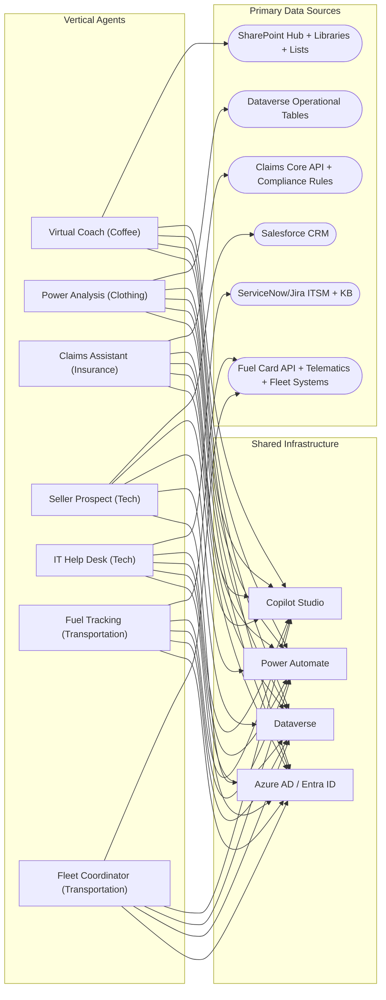

## Coffee -- Virtual Coach

### SharePoint Knowledge Architecture

This architecture represents the three-tier SharePoint information hierarchy used by Virtual Coach. Content libraries and lists feed Copilot Studio knowledge grounding and operational topic actions.

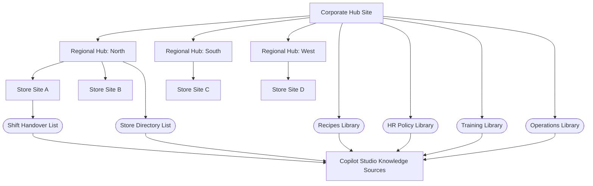

### Conversation Flow

This flow shows how an incoming message is routed into one of five major intents, then either grounded from knowledge sources or fulfilled via list/query actions before response generation.

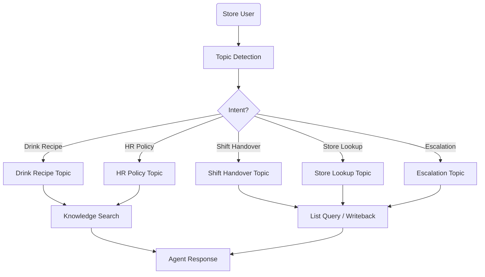

## Clothing -- Power Analysis

### Dataverse Data Model

This ER diagram captures the core retail analysis entities and the key store/SKU relationships used to support decomposition and root-cause reasoning.

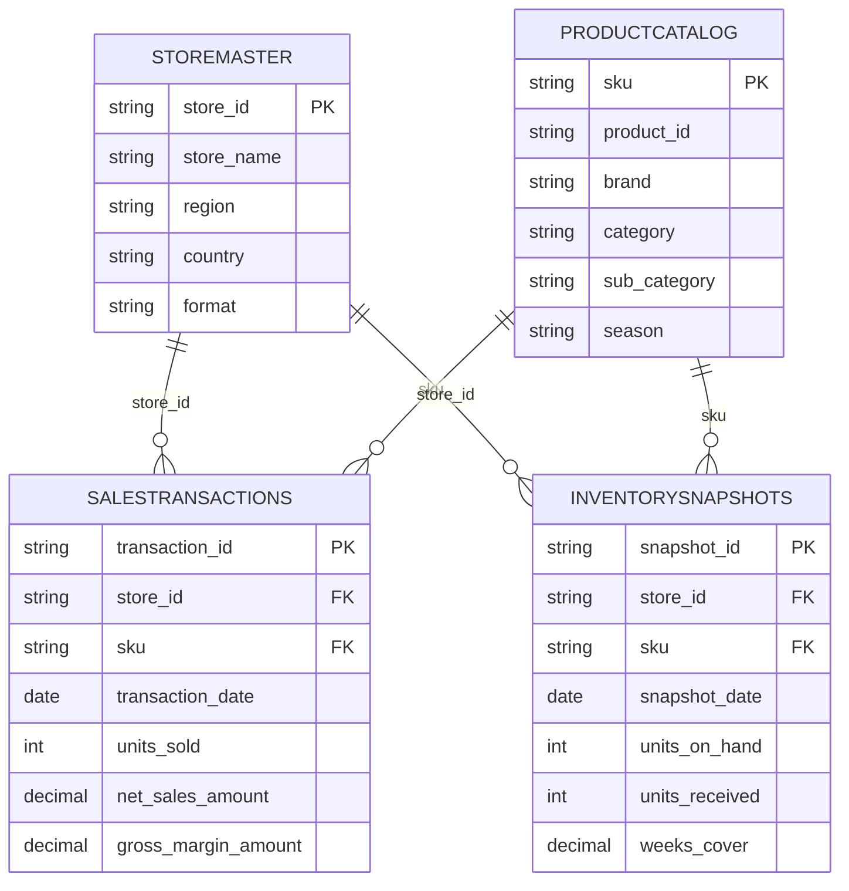

### Multi-Step Reasoning Flow

This sequence shows decomposition behavior for a root-cause question, where the agent orchestrates multiple analytical queries before synthesizing a single explanation.

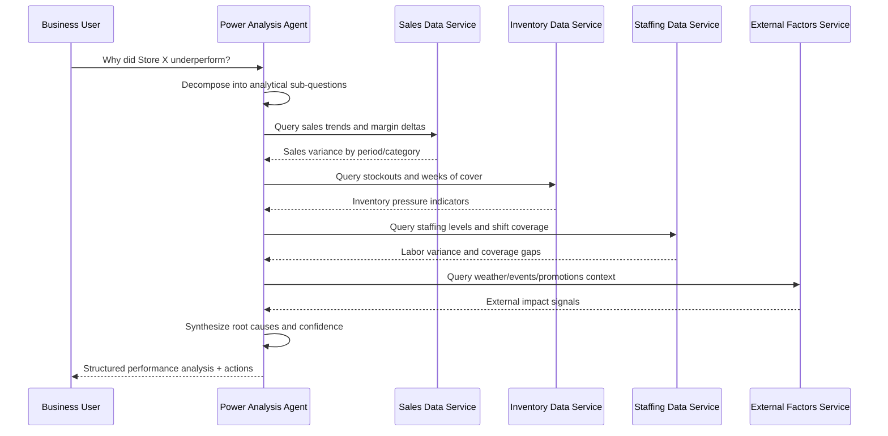

### Data Pipeline Architecture

This pipeline illustrates operational ingestion from POS to Dataverse and downstream analytical branching for agent retrieval and long-horizon historical analysis.

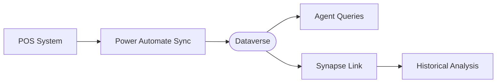

## Insurance -- Claims Assistant

### Claims Lifecycle Flow

This is the primary operating model for the claims journey. The diagram explicitly marks where automation is owned by the agent versus where human adjusters or investigators are mandatory.

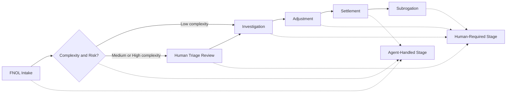

### Fraud Detection Pipeline

This pipeline shows fraud signal processing from intake through scoring and risk-tiered routing to automation or specialist review.

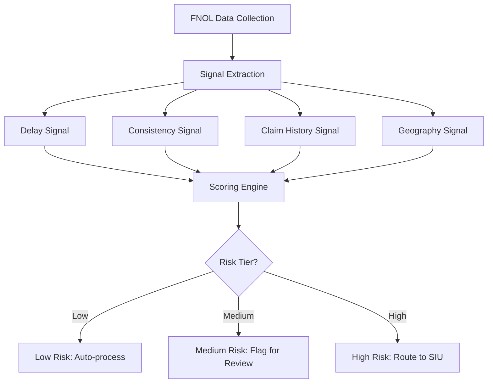

### Regulatory Compliance Flow

This sequence captures mandatory state-level control points before claim progression, ensuring disclosure and audit logging are completed in-band.

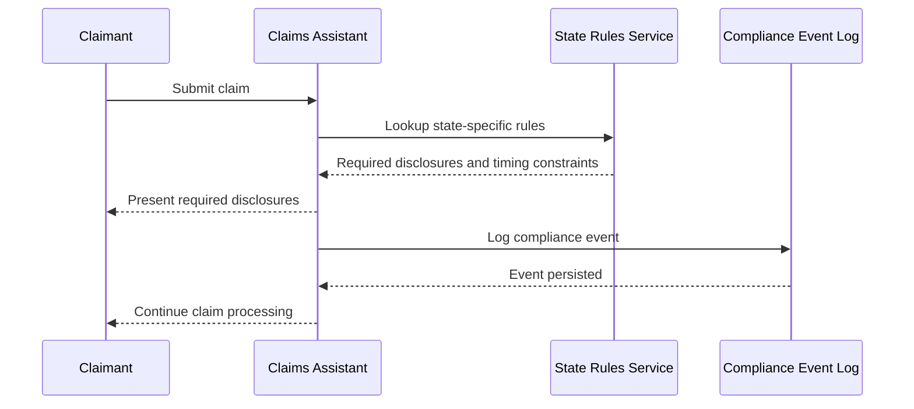

## Tech -- Seller Prospect

### Dual-Channel Architecture

This architecture separates internal and external entry points while preserving one shared agent runtime. Channel and identity context determines topic set and data boundary.

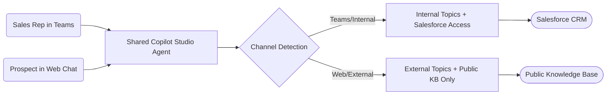

### Lead Qualification Funnel

This flow covers the external lead journey from first contact through BANT scoring and branching into sales handoff or nurture.

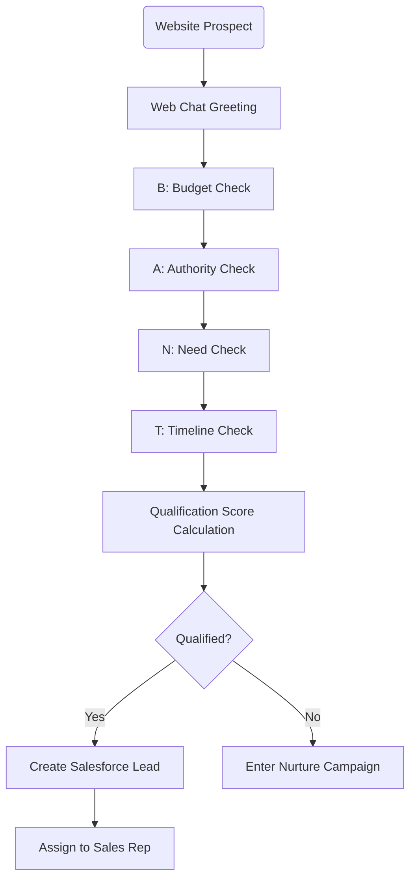

### Salesforce Integration Flow

This sequence shows topic-triggered CRM actions executed through Power Automate with OAuth token acquisition, API invocation, and structured response mapping.

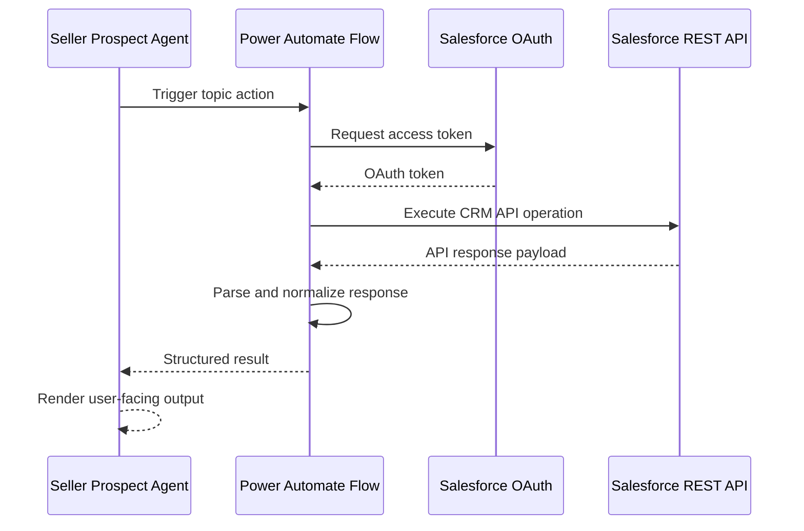

## Transportation -- Fuel Tracking

### Anomaly Detection Pipeline

This pipeline illustrates hourly transaction ingestion, multi-rule evaluation, and bifurcation into clean persistence or anomaly alerting for fleet operations.

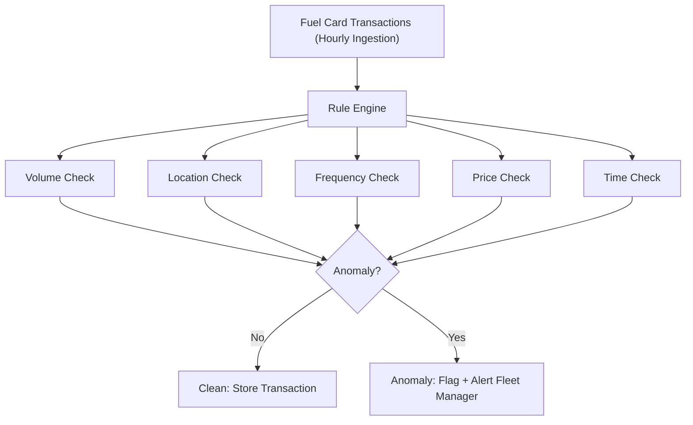

### System Integration Architecture

This diagram shows upstream transportation data feeds, automation pipelines, Dataverse storage, and downstream conversational surfaces for managers and drivers.

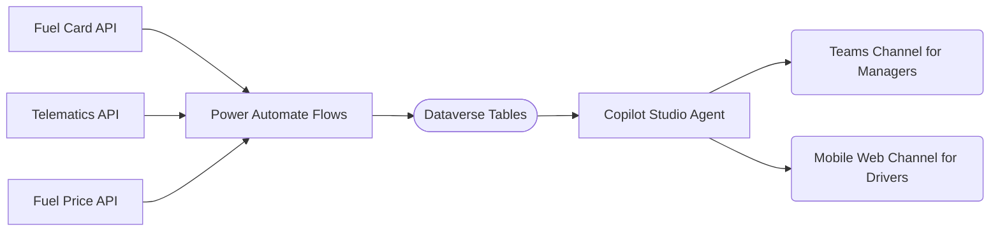

## Cross-Cutting

### Deployment Pipeline

This release flow represents the standard promotion path from scaffolded development to production rollout and post-release monitoring.

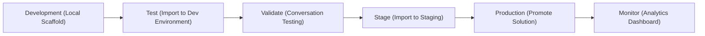

### Authentication Flow

This sequence diagram shows channel-specific authentication patterns with a shared identity outcome: user context and delegated token propagation into downstream flows.

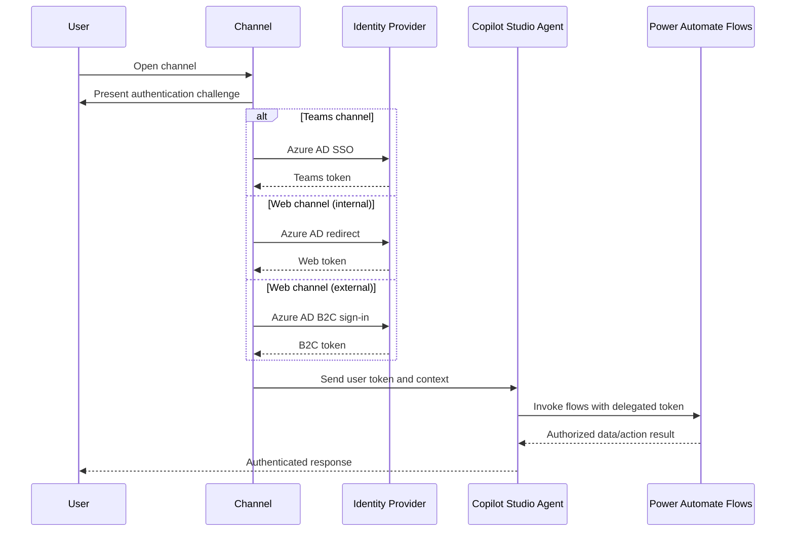

