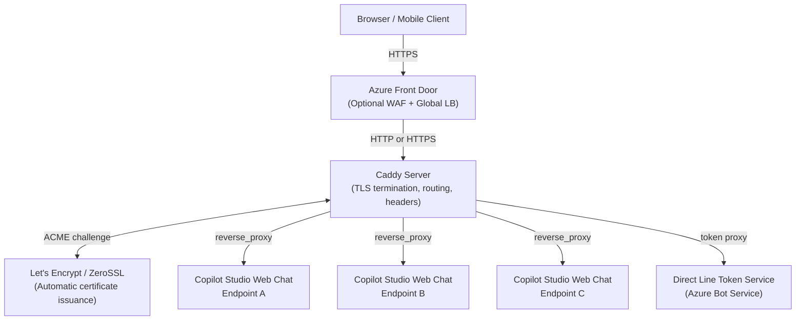
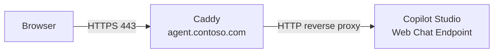
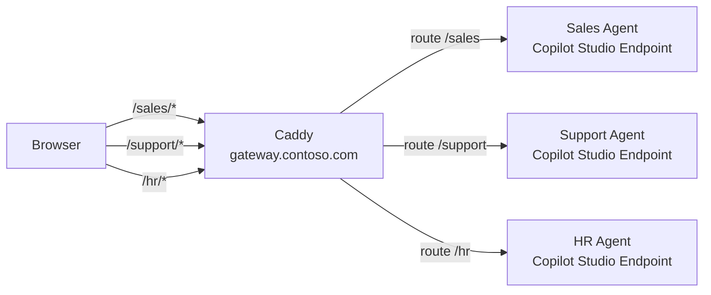
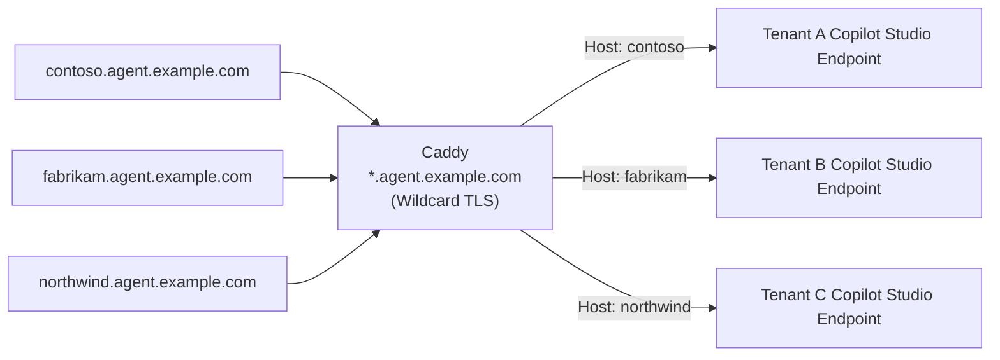
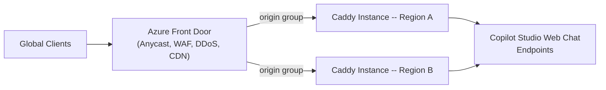
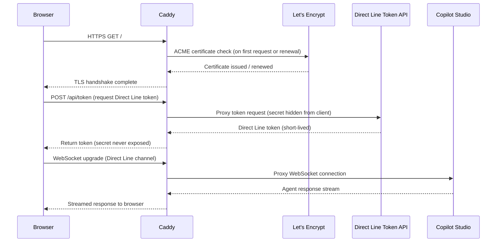

# Caddy Reverse Proxy Architecture for Copilot Studio Web Chat

## Overview

This document describes the reference architecture for hosting Copilot Studio web chat endpoints behind a Caddy reverse proxy. Caddy provides automatic TLS certificate management via Let's Encrypt, clean declarative configuration, and a rich middleware model suited for production web chat deployments.

The architecture covers four deployment patterns:

1. Single Agent -- one custom domain proxied to one Copilot Studio web chat endpoint.
2. Multi-Agent Gateway -- one domain with URL path routing to multiple agents.
3. Multi-Tenant -- subdomain-based routing where each tenant gets an isolated agent endpoint.
4. Load Balanced -- multiple Caddy instances fronted by Azure Front Door for global scale and WAF protection.

---

## Component Map

---

## Deployment Patterns

### Pattern 1: Single Agent

One Caddy host block maps a single custom domain to one Copilot Studio web chat URL. Suited for focused deployments where one agent handles all conversations on a branded domain.

Key responsibilities of Caddy in this pattern:

- TLS termination with automatic certificate renewal.
- Security response headers (CSP, HSTS, X-Frame-Options).
- Rate limiting per client IP.
- Access log for audit trail.
- Health check endpoint at `/healthz`.

See `caddyfile-templates/single-agent.Caddyfile` for the full configuration.

---

### Pattern 2: Multi-Agent Gateway

One domain serves multiple agents differentiated by URL path prefix. Caddy matches the request path and proxies to the corresponding Copilot Studio endpoint.

Path routing rules:

| Path prefix | Target agent |
|---|---|
| `/sales` | Sales agent endpoint |
| `/support` | Support agent endpoint |
| `/hr` | HR agent endpoint |

See `caddyfile-templates/multi-agent-gateway.Caddyfile`.

---

### Pattern 3: Multi-Tenant

Each tenant receives a dedicated subdomain. Caddy uses a wildcard TLS certificate and routes based on the `Host` header to the correct Copilot Studio endpoint.

DNS prerequisite: a wildcard A or CNAME record pointing `*.agent.example.com` to the Caddy server IP.

See `caddyfile-templates/multi-tenant.Caddyfile`.

---

### Pattern 4: Load Balanced with Azure Front Door

For global reach and enterprise WAF protection, multiple Caddy instances are placed behind Azure Front Door. Front Door handles Anycast routing, DDoS protection, and WAF rule evaluation. Caddy instances handle TLS for origin-to-Caddy segments and apply per-instance rate limiting.

When Front Door is in front:

- TLS termination at Front Door edge is optional; use private link or IP restriction to ensure only Front Door can reach Caddy.
- Caddy should validate the `X-Azure-FDID` request header to reject direct bypass traffic.
- Rate limiting at Caddy complements WAF rules at Front Door.

---

## Request Flow: Single Agent (Annotated)

---

## Caddy Feature Usage

| Feature | Usage in this architecture |
|---|---|
| Automatic HTTPS | Let's Encrypt or ZeroSSL certificates managed automatically |
| `reverse_proxy` | Forwards requests to Copilot Studio web chat endpoints |
| `rate_limit` | Protects against abuse per client IP |
| `header` | Adds CSP, HSTS, X-Frame-Options, CORS headers |
| `log` | Structured access log for audit compliance |
| `respond` | Serves health check endpoint at `/healthz` |
| `tls` | Wildcard certificate configuration for multi-tenant pattern |
| Environment variable substitution | Secrets and hostnames kept outside Caddyfile source |

---

## Environment Variable Reference

All Caddyfile templates use environment variable substitution (`{$VAR_NAME}`) to keep secrets and environment-specific values outside version control.

| Variable | Description |
|---|---|
| `AGENT_DOMAIN` | Public custom domain for the agent (e.g., `agent.contoso.com`) |
| `COPILOT_UPSTREAM` | Copilot Studio web chat upstream URL |
| `DIRECTLINE_SECRET` | Azure Bot Service Direct Line channel secret |
| `ALLOWED_ORIGINS` | Comma-separated list of approved CORS origins |
| `RATE_LIMIT_REQUESTS` | Requests allowed per window per IP |
| `RATE_LIMIT_WINDOW` | Time window for rate limiting (e.g., `10s`) |
| `LOG_FILE` | Path to structured access log output file |
| `TLS_EMAIL` | Email address for Let's Encrypt registration |
| `WILDCARD_DOMAIN` | Root domain for multi-tenant wildcard certificate |
| `TENANT_A_UPSTREAM` | Upstream for tenant A in multi-tenant pattern |
| `TENANT_B_UPSTREAM` | Upstream for tenant B in multi-tenant pattern |
| `AZURE_FD_ID` | Azure Front Door ID header value for origin validation |
