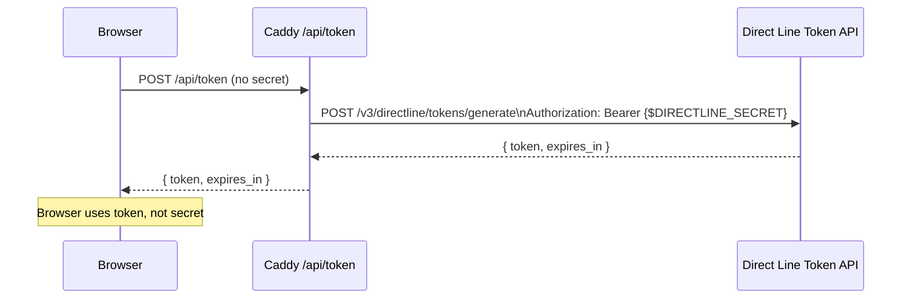
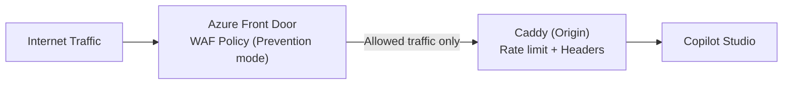

# Caddy Security Hardening Guide

## Overview

This document details the security controls applied to the Caddy reverse proxy when hosting Copilot Studio web chat endpoints. Each control is explained with rationale, configuration reference, and implementation notes.

The controls are organized into seven areas:

1. TLS configuration
2. Content Security Policy
3. CORS enforcement
4. IP allowlisting
5. Rate limiting
6. Direct Line secret protection (token proxy)
7. WAF integration via Azure Front Door

---

## 1. TLS Configuration

### Automatic HTTPS

Caddy obtains and renews TLS certificates automatically via Let's Encrypt (ACME protocol). No manual certificate management is required.

Key behaviors:

- HTTP (port 80) is automatically redirected to HTTPS (port 443).
- Certificates are renewed 30 days before expiry.
- OCSP stapling is enabled by default.

### Minimum TLS version

Caddy's default TLS configuration already enforces TLS 1.2 as the minimum and prefers TLS 1.3. No additional configuration is required.

To explicitly document this behavior in your Caddyfile for audit purposes:

```caddyfile
tls {$TLS_EMAIL} {
  protocols tls1.2 tls1.3
  # Caddy's default cipher selection is already secure.
  # Only override ciphers if your compliance framework mandates a specific approved list.
  # ciphers TLS_ECDHE_ECDSA_WITH_AES_128_GCM_SHA256 \
  #         TLS_ECDHE_RSA_WITH_AES_128_GCM_SHA256 \
  #         TLS_ECDHE_ECDSA_WITH_AES_256_GCM_SHA384 \
  #         TLS_ECDHE_RSA_WITH_AES_256_GCM_SHA384 \
  #         TLS_ECDHE_ECDSA_WITH_CHACHA20_POLY1305_SHA256 \
  #         TLS_ECDHE_RSA_WITH_CHACHA20_POLY1305_SHA256
}
```

### HTTP Strict Transport Security (HSTS)

The `Strict-Transport-Security` header instructs browsers to use HTTPS exclusively for the domain for one year.

```caddyfile
header Strict-Transport-Security "max-age=31536000; includeSubDomains; preload"
```

Submit your domain to the HSTS preload list at hstspreload.org once you have confirmed the configuration is stable.

---

## 2. Content Security Policy

### Purpose

The Content Security Policy (CSP) header restricts the resources that the browser is permitted to load for the web chat page. This mitigates cross-site scripting (XSS), clickjacking via malicious iframes, and data exfiltration.

### Web Chat CSP Requirements

The Bot Framework Web Chat client requires:

- `script-src`: allow the CDN hosting the web chat bundle (`cdn.botframework.com`) and inline scripts for the initialization snippet.
- `style-src`: allow inline styles for the web chat component.
- `connect-src`: allow connections to `directline.botframework.com` and the WebSocket endpoint `wss://directline.botframework.com`.
- `img-src`: allow `data:` URIs for embedded images in chat messages.
- `frame-ancestors`: explicitly list the origins that are allowed to embed the chat in an iframe.

### Recommended CSP Header

```caddyfile
Content-Security-Policy "default-src 'self'; script-src 'self' 'unsafe-inline' https://cdn.botframework.com; style-src 'self' 'unsafe-inline'; img-src 'self' data: https:; connect-src 'self' https://directline.botframework.com wss://directline.botframework.com; frame-ancestors {$ALLOWED_ORIGINS};"
```

### Tightening CSP Over Time

1. Deploy with `Content-Security-Policy-Report-Only` first to audit violations without blocking.
2. Set up a CSP report collector endpoint or use a third-party service.
3. Review violation reports and remove unnecessary directives.
4. Switch to enforcement mode (`Content-Security-Policy`) once violations are resolved.

```caddyfile
# Reporting mode (non-blocking)
header Content-Security-Policy-Report-Only "default-src 'self'; ... report-uri /csp-report"
```

---

## 3. CORS Enforcement

### Purpose

Cross-Origin Resource Sharing (CORS) headers control which external origins can make requests to the Caddy-hosted endpoints. Misconfigured CORS can allow unauthorized sites to interact with the Direct Line token endpoint or the web chat proxy.

### Policy

- Allow only explicitly listed origins.
- Do not use wildcard (`*`) in production.
- Restrict allowed methods to GET, POST, and OPTIONS.

### Caddyfile Implementation

```caddyfile
@cors_preflight {
  method OPTIONS
}
handle @cors_preflight {
  header Access-Control-Allow-Origin "{$ALLOWED_ORIGINS}"
  header Access-Control-Allow-Methods "GET, POST, OPTIONS"
  header Access-Control-Allow-Headers "Content-Type, Authorization"
  header Access-Control-Max-Age "3600"
  respond "" 204
}
```

Set `ALLOWED_ORIGINS` to the exact origin of the page embedding the web chat, for example `https://agent.contoso.com`. Do not append a trailing slash.

For multiple allowed origins, implement a dynamic CORS handler using Caddy's CEL expressions or a Lua middleware module, rather than using a wildcard.

---

## 4. IP Allowlisting

### Use Case

Internal agents intended only for corporate users should be restricted to known IP ranges. This prevents public internet access to the agent even if the custom domain is reachable.

### Caddyfile Implementation

```caddyfile
@allowed_ips {
  remote_ip 10.0.0.0/8 172.16.0.0/12 192.168.0.0/16 203.0.113.0/24
}

@blocked {
  not remote_ip 10.0.0.0/8 172.16.0.0/12 192.168.0.0/16 203.0.113.0/24
}

handle @blocked {
  respond "Forbidden" 403
}

handle @allowed_ips {
  # reverse_proxy block here
}
```

Replace the CIDR ranges with your organization's trusted IP ranges or Azure Virtual Network address spaces.

### Combining with Azure Front Door

When Caddy is behind Azure Front Door, the `remote_ip` is the Front Door edge IP, not the client IP. In this case:

- Use `X-Forwarded-For` header to extract the original client IP, but only after confirming the request came through Front Door (validated via `X-Azure-FDID`).
- Apply IP filtering at the Azure Front Door WAF level using custom rules rather than in Caddy.

---

## 5. Rate Limiting

### Purpose

Rate limiting per client IP protects the web chat endpoint and the Direct Line token API from abuse, credential stuffing, and denial-of-service via excessive request volume.

### Module

Rate limiting requires the `caddy-ratelimit` module. Build Caddy with this module as described in the deployment guide:

```bash
xcaddy build --with github.com/mholt/caddy-ratelimit
```

### Recommended Configuration

```caddyfile
rate_limit {
  zone per_ip {
    key {remote_host}
    events {$RATE_LIMIT_REQUESTS}
    window {$RATE_LIMIT_WINDOW}
  }
}
```

Recommended starting values:

| Endpoint type | `RATE_LIMIT_REQUESTS` | `RATE_LIMIT_WINDOW` |
|---|---|---|
| Web chat page load | 20 | 10s |
| Direct Line token endpoint | 5 | 60s |
| Health check | 100 | 10s |

Apply tighter limits to the token endpoint to prevent Direct Line token farming.

---

## 6. Direct Line Secret Protection (Token Proxy)

### Problem

The Bot Framework Direct Line channel requires a secret or token to establish a conversation. Embedding the secret directly in client-side JavaScript exposes it to anyone who views the page source, enabling unauthorized bots to connect to your agent.

### Solution: Token Proxy Pattern

Caddy acts as a token proxy. The client requests a short-lived token from a Caddy endpoint. Caddy holds the Direct Line secret server-side and exchanges it for a one-time-use token, returning only the token to the client.



### Token Properties

- Tokens have a limited lifespan defined by the Direct Line API (consult the current Azure Bot Service Direct Line documentation for the exact expiry duration, as it is subject to change).
- Tokens can be refreshed before expiry using the Direct Line token refresh endpoint.
- A compromised token can be revoked by regenerating the Direct Line secret, which invalidates all outstanding tokens.

### Caddyfile Implementation

```caddyfile
handle /api/token {
  uri strip_prefix /api/token
  reverse_proxy https://directline.botframework.com/v3/directline/tokens/generate {
    header_up Authorization "Bearer {$DIRECTLINE_SECRET}"
    header_up Content-Type "application/json"
    header_down -Server
  }
}
```

Store `DIRECTLINE_SECRET` in `/etc/caddy/env.d/agent.env` with file permissions `640` (readable only by root and the caddy group). Never log this value.

---

## 7. WAF Integration via Azure Front Door

### Architecture

When deploying the load-balanced pattern, Azure Front Door provides a Web Application Firewall (WAF) with managed rule sets for OWASP Top 10 and bot protection. Caddy sits behind Front Door and provides per-origin rate limiting and header enforcement.



### WAF Rule Set Recommendations

| Rule set | Purpose |
|---|---|
| Microsoft DefaultRuleSet 2.1 | OWASP Top 10 coverage |
| Microsoft BotManagerRuleSet 1.1 | Block known bad bots and scanners |
| Custom rule: X-Azure-FDID check | Enforce traffic from Front Door only |

### Bypass Prevention

Restrict direct access to Caddy's public IP to Azure Front Door only:

1. In the Azure portal, identify the Front Door instance ID (shown in the Overview blade).
2. Add `AZURE_FD_ID` to the Caddy environment file.
3. Add this block to the Caddyfile before any other handlers:

```caddyfile
@not_from_afd {
  not header X-Azure-FDID {$AZURE_FD_ID}
}
handle @not_from_afd {
  respond "Forbidden" 403
}
```

4. Additionally restrict inbound port 443 to the Azure Front Door IP service tag using a Network Security Group or host-based firewall rule.

---

## Security Headers Reference

| Header | Value | Purpose |
|---|---|---|
| `Strict-Transport-Security` | `max-age=31536000; includeSubDomains; preload` | Enforce HTTPS for one year |
| `Content-Security-Policy` | See Section 2 | Restrict resource loading and framing |
| `X-Frame-Options` | `SAMEORIGIN` | Prevent clickjacking from unknown origins |
| `X-Content-Type-Options` | `nosniff` | Prevent MIME type sniffing |
| `Referrer-Policy` | `strict-origin-when-cross-origin` | Limit referrer information leakage |
| `Permissions-Policy` | `geolocation=(), microphone=(), camera=()` | Disable unused browser APIs |
| `-Server` | (removed) | Hide Caddy version from responses |

---

## Security Checklist

| Control | Configuration location | Status owner |
|---|---|---|
| TLS 1.2 minimum enforced | Caddyfile `tls` block | Platform engineering |
| HSTS header with preload | Caddyfile `header` block | Platform engineering |
| CSP header enforced (not report-only) | Caddyfile `header` block | Security architecture |
| CORS restricted to approved origins | Caddyfile `@cors_preflight` handler | Security architecture |
| IP allowlist configured for internal agents | Caddyfile `remote_ip` matcher | Network security |
| Rate limiting active on token endpoint | Caddyfile `rate_limit` block | Platform engineering |
| Direct Line secret not exposed to client | Token proxy at `/api/token` | Agent engineering |
| `DIRECTLINE_SECRET` file permissions 640 | `/etc/caddy/env.d/agent.env` | Operations |
| Azure Front Door ID validation | Caddyfile `@not_from_afd` handler | Security architecture |
| WAF in Prevention mode | Azure Front Door WAF Policy | Security architecture |
| Server header removed from responses | Caddyfile `header -Server` | Platform engineering |
| Access logs retained and reviewed | `/var/log/caddy/access.log` | Compliance |
