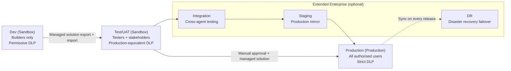

# Environment Topology

## Overview
This document defines the canonical environment topology for all Copilot Studio agents across every vertical in this repository (Coffee, Clothing, Insurance, Tech, Transportation). It describes both the standard three-tier topology required for all deployments and the extended enterprise topology for organisations with more complex requirements.

## Standard Three-Tier Topology

All verticals must use a minimum of three environments before any agent reaches production users.

| Environment | Type | Purpose | DLP Policy | Authorised Users |
|-------------|------|---------|------------|-----------------|
| Dev | Developer/Sandbox | Agent building and iterative development | Permissive | Builders only |
| Test/UAT | Sandbox | Stakeholder acceptance testing and integration validation | Production-equivalent | Testers and stakeholders |
| Production | Production | Live user traffic | Strict | All authorised users |

### Dev Environment
- One environment per vertical team or per individual builder, depending on team size.
- Type: Sandbox (supports unmanaged solutions for rapid iteration).
- DLP policy: permissive -- custom connectors, HTTP connector, and AI Builder credits are all allowed to accelerate development.
- Data sources: developer-specific sandbox data, mocked APIs, test credentials.
- Access: restricted to the agent builder. No business users or stakeholders.

### Test/UAT Environment
- One shared environment per vertical (all agents within a vertical share this environment).
- Type: Sandbox (supports managed solution imports from Dev).
- DLP policy: mirrors the production DLP policy so integration issues are caught before go-live.
- Data sources: test/staging data sources, staging API endpoints, no production data.
- Access: QA engineers, UAT testers, business stakeholders, and agent owners.

### Production Environment
- One dedicated production environment per vertical.
- Type: Production (prevents unmanaged solution changes; enforces managed-solution governance).
- DLP policy: strict -- HTTP connector blocked, custom connectors require explicit approval.
- Data sources: production databases, production APIs, production Azure Key Vault.
- Access: all authorised end users for that vertical, read-only access for operations staff.

## Extended Enterprise Topology

Organisations with higher change risk, regulatory obligations, or multi-system integration requirements should adopt the extended five-environment topology.

| Environment | Added Purpose |
|-------------|--------------|
| Integration | Cross-agent testing, multi-system end-to-end integration validation |
| Staging | Production-mirror environment for final pre-release validation and load testing |
| DR | Disaster recovery failover environment, kept in sync with production |

### Integration Environment
- Positioned between Test/UAT and Staging.
- Validates that multiple agents within the same vertical and across verticals work correctly together.
- Use case: Transportation fleet-coordinator and fuel-tracking agents must be integration-tested together before either is staged or promoted.
- Access: integration engineers and senior QA.

### Staging Environment
- Production mirror: identical DLP policy, identical environment variable configuration (pointing to production-equivalent pre-production endpoints).
- Used for final smoke testing, performance testing, and security review before a production promotion.
- Access: release manager, IT admin, and security reviewer.

### DR Environment
- Maintained as a cold or warm standby.
- Receives the same managed solution import as production on every release cycle.
- Tested quarterly via a DR drill: simulate production failure, switch traffic to DR, verify agent operation, switch back.
- Access: IT admin only except during a declared DR event.

## Environment Naming Convention

Use the pattern `<org>-<vertical>-<stage>` for all environment names registered in the Power Platform Admin Center.

Examples:
- `contoso-coffee-dev`
- `contoso-coffee-test`
- `contoso-coffee-prod`
- `contoso-transportation-integration`
- `contoso-insurance-staging`
- `contoso-tech-dr`

## Security Role Assignments

Apply the following role assignments in every environment.

| Role | Dev | Test/UAT | Production |
|------|-----|----------|------------|
| System Administrator | IT admin | IT admin | IT admin only |
| Environment Maker | Agent builders | Not assigned (import only) | Not assigned |
| Basic User | Not required | UAT testers, stakeholders | All authorised users |
| Service Account | Power Automate connection user | Power Automate connection user | Power Automate connection user |

## Environment Variable Configuration Summary

Each environment tier requires its own environment variable values. See `environment-variable-matrix.md` for the full per-vertical, per-environment variable matrix. The key principle is:

- Dev: developer-scoped sandbox endpoints and test credentials.
- Test/UAT: staging endpoints; no production credentials.
- Production: production endpoints; secrets resolved from the production Azure Key Vault only.

## Topology Diagram

## Related Documents
- `docs/strategy/promotion-pipeline.md` -- step-by-step promotion process and gate criteria.
- `docs/strategy/dlp-policy-templates.md` -- DLP connector policies for each environment tier.
- `docs/strategy/environment-variable-matrix.md` -- variable values per environment per vertical.
- `docs/admin-governance.md` -- tenant administration, licensing, and audit logging.
- `docs/agent-lifecycle.md` -- full agent lifecycle from development through retirement.
