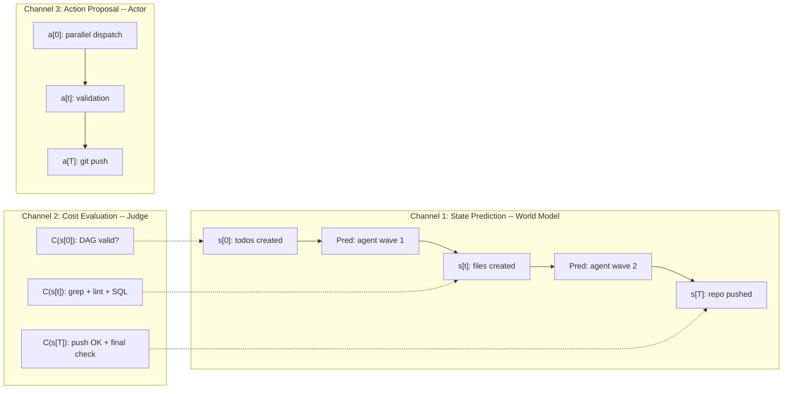
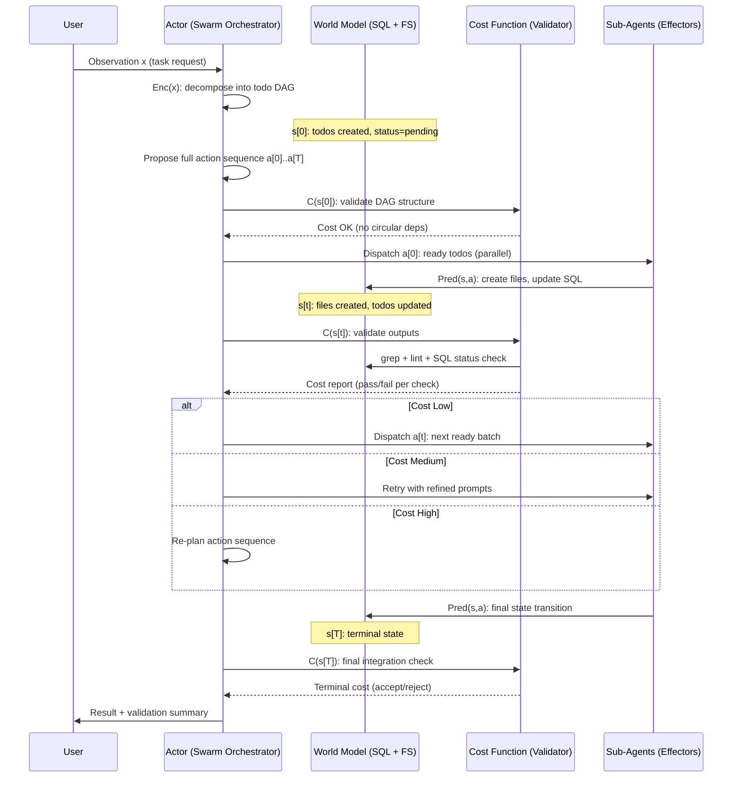

# Swarm Architecture: LeCun System-2 to DAYOURBOT Orchestration Mapping

## 1. Overview

The DAYOURBOT swarm orchestration pattern is architecturally isomorphic to Yann LeCun's System-2 Model-Based Perception-Planning-Action Cycle. Both implement a model-predictive control loop with parallel state prediction, cost evaluation, and action optimization.

This document formalizes the structural correspondence between LeCun's theoretical framework -- drawn from JEPA and World Model research (Henaff et al., ICLR 2019; Hafner et al., ICML 2019; Chaplot et al., ICML 2021) -- and the concrete multi-agent swarm orchestration pattern used in this repository.

The mapping is not metaphorical. The swarm literally implements the same computational graph: an encoder decomposes observations into latent state, a predictor rolls state forward through agent executions, a cost module evaluates each intermediate state, and an actor proposes action sequences that are optimized before commitment.

---

## 2. LeCun's System-2 Architecture

### Core Principle

The System-2 architecture is akin to classical Model-Predictive Control (MPC). The system does not react to stimuli directly. Instead, it:

1. The **Actor** proposes an action sequence.
2. The **World Model** predicts the outcome of that sequence.
3. The **Actor** optimizes the action sequence to minimize a cost function.
4. The **Actor** sends only the first action(s) to the effectors.

Optimization methods include gradient descent, dynamic programming, and Monte Carlo tree search.

### Data Flow

```
x -> Enc(x) -> s[0] -> Pred(s,a) -> s[t] -> Pred(s,a) -> s[t+1] -> ... -> s[T]
                 |                    |                      |                  |
               C(s[0])             C(s[t])              C(s[t+1])          C(s[T])
                 ^                    ^                      ^
               a[0]                a[t]                  a[t+1]
```

Where:
- `x` is the raw observation.
- `Enc(x)` is the encoder that maps observation to latent state.
- `s[t]` is the latent state at time step t.
- `Pred(s, a)` is the predictor (world model) that computes the next state given current state and action.
- `C(s[t])` is the cost function evaluated at each predicted state.
- `a[t]` is the action proposed by the actor at step t.

### Three Parallel Channels

The architecture operates three concurrent processing channels:

1. **State Prediction Chain (World Model):** `s[0] -> s[t] -> s[t+1] -> s[T]` -- Rolling forward through predicted future states.
2. **Cost Evaluation Chain (Judge):** `C(s[0]), C(s[t]), ..., C(s[T])` -- Evaluating the quality of each predicted state independently.
3. **Action Proposal Chain (Actor):** `a[0], a[t], a[t+1]` -- Proposing and refining the sequence of actions that drive state transitions.

These channels are not sequential. They operate in parallel, with the cost evaluations feeding back into the actor's optimization of the action sequence.

---

## 3. DAYOURBOT Swarm Mapping

The following table establishes the formal correspondence between LeCun's System-2 components and their swarm implementation.

| LeCun System-2 Component | Swarm Equivalent | Implementation Detail |
|---|---|---|
| Observation `x` | User request | Natural language task description provided to the swarm orchestrator |
| Encoder `Enc(x)` | Task decomposition | `dayour-swarm` parses intent, identifies relevant domains, and builds a dependency DAG |
| Latent state `s[t]` | SQL todos table | Shared mutable state: `todos.status` tracks progress across all agents |
| Predictor `Pred(s, a)` | Sub-agent execution | Each `task()` dispatch transforms state (creates files, modifies code, updates SQL) |
| Cost function `C(s[t])` | Quality validation | qa-validator, grep checks, YAML lint, debate scoring, LLM-as-judge |
| Actor | Swarm orchestrator | `dayour-swarm` proposes the optimal action sequence as a todo DAG |
| Action `a[t]` | Agent dispatch | `task(agent_type, prompt, mode="background")` calls |
| Action optimization | DAG construction | Minimize inter-agent dependencies, maximize parallel fan-out |
| Effectors | Side effects | File system writes, git commits, GitHub API calls |
| "Send first action(s) only" | Ready todos first | Only dispatch todos whose dependencies are all in status `done` |

### Key Structural Correspondences

- **State is explicit and shared.** In LeCun's model, `s[t]` is a latent vector passed between predictor steps. In the swarm, the SQL todos table (plus the file system) serves as the explicit shared state that persists across agent dispatches.

- **Prediction is execution.** The predictor `Pred(s, a)` in the theoretical model computes a new state. In the swarm, dispatching an agent IS the prediction -- the agent transforms the world (writes files, updates SQL) and the resulting state is the new `s[t+1]`.

- **Cost is evaluated at every step, not just the end.** Both architectures evaluate cost at each intermediate state, enabling early termination or re-planning if the trajectory diverges from acceptable bounds.

---

## 4. Parallel Memory Channels

The three parallel channels manifest concretely in the swarm architecture.

### Channel 1 -- State Prediction (World Model)

```
user_request -> decompose -> s[0] (todos created)
  -> agent_dispatch -> s[t] (files created)
    -> agent_dispatch -> s[t+1] (more files)
      -> git_push -> s[T] (repo updated)
```

The SQL todos table IS the world model state. Each agent execution is a state transition `Pred(s, a)` that transforms the todo statuses and produces artifacts. The state is fully observable: at any point, a query against the todos table reveals the complete system state.

```sql
-- Observe current world model state
SELECT id, title, status FROM todos ORDER BY created_at;
```

### Channel 2 -- Cost Evaluation (Judge)

```
C(s[0]): Verify todo DAG is valid (no circular deps, all IDs unique)
C(s[t]): After each agent wave, validate outputs:
  - grep for prohibited content (customer names, secrets)
  - YAML syntax validation
  - Convention compliance (scaffold pattern, heading hierarchy)
  - SQL status check (did agent update its todo?)
C(s[T]): Final integration validation (git status clean, push succeeds)
```

This is the LLM-as-judge pattern running in parallel with production. The cost function is not a single scalar -- it is a composite of structural checks (grep), syntactic checks (lint), semantic checks (convention compliance), and integration checks (git push success).

### Channel 3 -- Action Proposal (Actor)

```
a[0]: [scaffolder, runbook-automator, issue-assigner] -- parallel batch 1
a[t]: [qa-validator] -- depends on batch 1 completing
a[t+1]: [git-push] -- depends on validation passing
```

The actor (swarm orchestrator) builds the full action sequence upfront as a todo DAG, but only commits the "ready" batch to effectors at each step. This is the receding horizon principle from MPC: plan the full trajectory, execute only the immediate actions, then re-plan.

```sql
-- Actor: find ready actions (no pending dependencies)
SELECT t.* FROM todos t
WHERE t.status = 'pending'
AND NOT EXISTS (
    SELECT 1 FROM todo_deps td
    JOIN todos dep ON td.depends_on = dep.id
    WHERE td.todo_id = t.id AND dep.status != 'done'
);
```

---

## 5. MPC Optimization in Practice

The swarm implements Model-Predictive Control through five concrete mechanisms.

### Plan Ahead

Build the full todo DAG before dispatching any agent. This is the "action sequence proposal." The DAG encodes not just what to do, but the ordering constraints and parallelism opportunities.

```sql
-- Full action sequence proposed upfront
INSERT INTO todos (id, title, status) VALUES
  ('scaffold', 'Create agent scaffold', 'pending'),
  ('runbook', 'Generate browser runbook', 'pending'),
  ('validate', 'Run QA validation', 'pending'),
  ('push', 'Commit and push', 'pending');

INSERT INTO todo_deps (todo_id, depends_on) VALUES
  ('validate', 'scaffold'),
  ('validate', 'runbook'),
  ('push', 'validate');
```

### Predict Outcomes

Each agent's prompt includes acceptance criteria. The swarm predicts what the agent will produce and plans the next steps accordingly. This is analogous to the world model predicting `s[t+1]` given `s[t]` and `a[t]`.

### Evaluate Cost at Each Step

After each wave of agents completes:

1. **Check SQL for status='done'** -- the source of truth, not the agent's self-report.
2. **Validate outputs** -- grep for prohibited content, YAML lint, convention checks.
3. **If cost is high (failures detected)** -- re-plan: adjust prompts, retry, or escalate.

### Commit Only First Actions

Only dispatch the current "ready" batch -- todos with no pending dependencies. This is exactly "Actor sends first action(s) to effectors." The remaining actions stay in the plan but are not committed until the current batch resolves.

### Re-Plan After Observation

After agents return, the orchestrator observes the new state and may:

- **Dispatch the next batch** if cost is low (all validations pass).
- **Retry failed agents with refined prompts** if cost is medium (partial failures).
- **Escalate or redesign the approach** if cost is high (systemic failures).

This re-planning step is what distinguishes MPC from open-loop control. The swarm does not blindly execute its initial plan -- it adjusts based on observed outcomes.

---

## 6. Concrete Example: Policy Advisor Build

The following traces an actual session through the LeCun architecture mapping.

### Step 1: Observation and Encoding

```
Observation x: "Analyze these 18 slides, create a genericized Policy Advisor agent"

Enc(x): Swarm decomposes into 3 todos:
  - policy-advisor-scaffold (5 files)
  - policy-advisor-browser-runbook (9 files)
  - policy-advisor-git-push (depends on both above)
```

### Step 2: Initial State

```
s[0]: 3 todos created, all status='pending'
```

### Step 3: First Action Batch

```
a[0]: Dispatch agent-3 (scaffold) + agent-4 (runbook) in parallel
```

Both agents have no unmet dependencies, so both are "ready" and dispatched simultaneously. This parallel fan-out is the actor exploiting independence in the DAG.

### Step 4: State Transition (Prediction)

```
Pred(s, a[0]): Agents execute, transforming state:
  - agent-3 creates 5 files, updates todo to 'done'
  - agent-4 creates 9 files, updates todo to 'done'
```

### Step 5: Intermediate State and Cost

```
s[t]: 2 todos 'done', 1 still 'pending' (git-push has unmet deps)

C(s[t]): Orchestrator validates:
  - grep for prohibited content: PASS (zero references)
  - File count: 14 files exist with content
  - SQL status: 2/3 done
```

### Step 6: Next Action

```
a[t]: git-push is now "ready" (dependencies met)

Pred(s, a[t]): Orchestrator commits and pushes
```

### Step 7: Terminal State and Final Cost

```
s[T]: All 3 todos 'done', repo updated

C(s[T]): Final validation:
  - Push succeeded
  - Zero prohibited content references
  - All files present on main branch
```

---

## 7. Inverse Debate as Cost Function Refinement

The inverse debate pattern implements a sophisticated multi-round cost function.

### Round Structure

- **Round 1 (Affirmative):** Agent argues a position. This produces an initial cost estimate -- how well does the proposed output satisfy requirements?
- **Round 2 (Inverse):** The same agent DESTROYS its own position. This produces a refined cost -- exposing weaknesses the initial evaluation missed.
- **Round 3 (Cross-validation):** Other agents score the debate. This produces an ensemble cost -- aggregating multiple perspectives.

### Analogy to Monte Carlo Tree Search

This is analogous to Monte Carlo Tree Search (MCTS), one of the optimization methods LeCun explicitly cites for action sequence optimization:

- **MCTS explores multiple evaluation paths** before committing to a move. Each simulation rolls out a different trajectory and evaluates the terminal state.
- **Inverse debate explores multiple evaluation perspectives** before committing to a quality judgment. Each round evaluates the same output from a different adversarial angle.

Both methods trade computation for confidence: more rounds (or simulations) produce a more reliable cost estimate, at the expense of wall-clock time.

---

## 8. Architecture Diagrams

### Three Parallel Channels



### MPC Cycle Sequence Diagram



---

## 9. References

1. Henaff, M., Canziani, A., & LeCun, Y. (2019). "Model-Predictive Policy Learning with Uncertainty Regularization for Driving in Dense Traffic." ICLR 2019.
2. Hafner, D., Lillicrap, T., Ba, J., & Norouzi, M. (2019). "Dream to Control: Learning Behaviors by Latent Imagination." ICML 2019.
3. Chaplot, D. S., Dalal, M., Gupta, S., Parisotto, E., & Salakhutdinov, R. (2021). "SEAL: Self-supervised Embodied Active Learning." ICML 2021.
4. LeCun, Y. (2022). "A Path Towards Autonomous Machine Intelligence." Technical report, version 0.9.2.
5. OpenAI. (2024). "Swarm: Lightweight Multi-Agent Orchestration Framework."
6. DAYOURBOT Fleet Operations Guide. See `guides/dayourbot-fleet-operations.md` in this repository.

---

## 10. Implications for Swarm Design

The LeCun mapping yields five actionable design principles for swarm orchestration.

### Principle 1: The Todo DAG IS the World Model

Invest in good state representation. The SQL todos table is not bookkeeping -- it is the latent state `s[t]` that the entire control loop depends on. Poorly structured todos produce poor predictions and poor cost evaluations.

### Principle 2: Parallel Cost Evaluation at Every State Transition

The qa-validator must run at EVERY state transition, not just at the end. In LeCun's model, `C(s[t])` is evaluated at every predicted state. Deferring validation to `C(s[T])` defeats the purpose of MPC -- the system cannot re-plan if it only discovers problems at the terminal state.

### Principle 3: Full Sequence Proposal, Partial Commitment

The actor should propose the FULL action sequence (the complete todo DAG) but only commit ready actions -- those with no pending dependencies. This is the MPC receding horizon: plan far, act near, then re-plan.

### Principle 4: Inverse Debate as Monte Carlo Tree Search

Inverse debate is the agent equivalent of MCTS for cost function refinement. Use it when the cost function is ambiguous or when the stakes of a wrong evaluation are high. The computational overhead is justified by the improved confidence in the cost estimate.

### Principle 5: Shared Memory Enables the Control Loop

The SQL todos table is the shared memory that enables the perception-planning-action loop to persist across agent dispatches. Without it, each agent operates in isolation and the orchestrator has no state to evaluate or plan against. The world model collapses.

---

*This document maps theoretical foundations to engineering practice. The DAYOURBOT swarm is not inspired by LeCun's System-2 architecture -- it independently converges on the same computational structure, because model-predictive control is the correct abstraction for multi-agent orchestration with quality constraints.*
