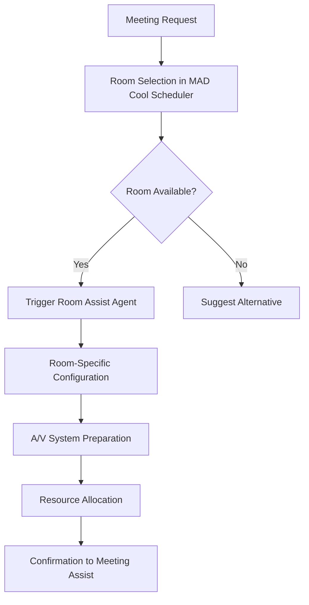

# MAD Cool Scheduler - Power App Analysis & Demo Potential 

Based on my examination of the **MAD Cool Scheduler** app and your MeetingAssist ecosystem, here's a comprehensive summary:

## App Details

- **Name**: MAD Cool Scheduler
- **Type**: Canvas App (Premium license required)
- **App ID**: <APP_ID>
- **Created**: July 2, 2025, 4:02:35 PM
- **Last Modified**: July 2, 2025, 4:44:21 PM
- **Environment**: MAD Cool
- **Owner**: MOD Administrator

## Current App Interface Features

The app displays a **meeting scheduling interface** with:

1. **Room Selection Dropdown**:
   - Meeting Room, Conf 1, Conf 2, Conf 3, Conf 4

2. **Meeting Context**:
   - "Meetings Owned By: Meeting Assistant"
   - Account field showing "Self"
   - Example request: "Book a meeting room for Wednesday at 4pm"

3. **Data Grid with Columns**:
   - Invite Subject
   - Recipient
   - Sent Date
   - Status
   - Status Reason
   - Record Created On
   - Import Sequence Number
   - Created On

4. **AI Assistant Response**:
   - "I'd be happy to help you with that. Do you already have a date and time in mind, or would you like the next available slot?"

## Enhanced Integration Architecture 

### Room Assist Agent Integration

Each of the 4 meeting rooms will be connected to dedicated **Room Assist agents** in Copilot Studio:

#### Room Configuration & Capabilities

1. **Conference Room 1 (Conf 1) - Executive Suite**
   - **Room Assist Agent ID**: `room-assist-conf1`
   - **Capacity**: 12 people
   - **Equipment**:
     - 75" Microsoft Surface Hub
     - Teams Room system with dual cameras
     - Wireless presentation capability
     - Executive catering service
   - **A/V Control**: Crestron XiO Cloud integration
   - **Functions**: `prepareExecutiveRoom()`, `configurePresentation()`, `orderCatering()`

2. **Conference Room 2 (Conf 2) - Collaboration Hub**
   - **Room Assist Agent ID**: `room-assist-conf2`
   - **Capacity**: 8 people
   - **Equipment**:
     - Interactive whiteboard
     - Teams Room with 360° camera
     - Breakout collaboration tools
   - **A/V Control**: Extron ControlScript integration
   - **Functions**: `setupCollaboration()`, `enableWhiteboard()`, `configureBreakouts()`

3. **Conference Room 3 (Conf 3) - Hybrid Meeting Center**
   - **Room Assist Agent ID**: `room-assist-conf3`
   - **Capacity**: 16 people
   - **Equipment**:
     - Dual 65" displays
     - Advanced audio system for hybrid meetings
     - Multiple Teams Room cameras
     - Document camera
   - **A/V Control**: Microsoft Graph Teams Device Management
   - **Functions**: `optimizeHybrid()`, `balanceAudio()`, `setupMultiDisplay()`

4. **Conference Room 4 (Conf 4) - Training & Presentation Room**
   - **Room Assist Agent ID**: `room-assist-conf4`
   - **Capacity**: 24 people
   - **Equipment**:
     - Projector and large screen
     - Podium with wireless mic
     - Recording capability
     - Audience response system
   - **A/V Control**: Combined Crestron/Graph API
   - **Functions**: `setupPresentation()`, `enableRecording()`, `configureAudience()`

#### Room Assist Agent Workflow



### Meeting Assist Chat Window Integration 

The **"Meeting Assistant"** section will be replaced with a **live chat window** powered by the **MeetingAssist orchestrator agent** from Copilot Studio.

#### Chat Window Specifications

**Component**: `MeetingAssistChatControl`

- **Agent Connection**: Direct integration with MeetingAssist orchestrator agent
- **Agent ID**: `meeting-assist-orchestrator`
- **Environment**: MAD Cool (<ENVIRONMENT_ID>)

#### Chat Window Features

1. **Natural Language Processing**:

   ```text
   User: "Set up a 60 min QBR with EMEA leadership next week"
   Agent: "I'll help you schedule that QBR. Let me check availability for EMEA leadership next week..."
   ```

2. **Multi-Agent Orchestration Display**:

   ```text
    Calendar Coordinator: Checking availability across timezones...
    Room & Resource Booker: Finding suitable conference room...
    Invite & RSVP Manager: Preparing invitation templates...
   ```

3. **Real-time Status Updates**:

   ```text
   [x] Found optimal time slot: Wednesday 3:00-4:00 PM GMT
    Conf 3 (Hybrid Center) reserved for 16 attendees
    Invitations sent to 12 EMEA leadership members
   ```

4. **Interactive Suggestions**:
   - Quick action buttons for common requests
   - Meeting type templates (QBR, All-Hands, Training, etc.)
   - Conflict resolution options
   - Rescheduling capabilities

#### Power Apps Integration Code

```powerquery
// Chat Control Integration
MeetingAssistChat = PowerPlatformConnectors.CopilotStudio(
    Environment: "<ENVIRONMENT_ID>",
    AgentId: "meeting-assist-orchestrator",
    ConversationId: GUID(),
    UserMessage: ChatInput.Text,
    Context: {
        CurrentUser: User().Email,
        SelectedRoom: RoomDropdown.Selected.Value,
        TimeZone: User().TimeZone,
        RequestType: "room_booking"
    }
)
```

## Integration with MeetingAssist Ecosystem

This app perfectly aligns with your **Room & Resource Booker** agent from the MeetingAssist architecture:

### Direct Alignment

- **Room & Resource Booker**: *"Locks physical rooms or virtual bridges, allocates catering, whiteboards, etc."*
- **Function**: `reserve(resourceType, timeSlot)`

### Demo Value for MeetingAssist

1. **Visual Interface for Room Booking**:
   - Demonstrates the UI component of the Room & Resource Booker agent
   - Shows available conference rooms (Conf 1-4) with specific capabilities
   - Provides a user-friendly interface for resource selection

2. **Meeting Request Processing**:
   - Shows natural language processing ("Book a meeting room for Wednesday at 4pm")
   - Demonstrates the conversation flow between user and AI assistant

3. **Data Management**:
   - Tracks meeting invitations and statuses
   - Maintains audit trail of booking requests
   - Shows integration capabilities with Dataverse

4. **Agent Integration Points**:
   - Can be triggered by the **Calendar Coordinator** agent when optimal slots are found
   - Feeds into the **Invite & RSVP Manager** for sending invitations
   - Coordinates with **A/V Control Agent** for room setup

## Enhanced Demo Scenarios 

### Scenario 1: Executive QBR Setup

```text
User Input: "Set up a 60 min QBR with EMEA leadership next week"

Chat Response:
 MeetingAssist: "I'll coordinate your EMEA QBR. Let me work with my specialist agents..."

 Calendar Coordinator: "Analyzing 12 EMEA executives' calendars across 5 timezones..."
[x] Found optimal slot: Wednesday 3:00-4:00 PM GMT (covers London-Dubai window)

 Room Assistant: "Conf 1 (Executive Suite) recommended for 12 attendees"
 Room Assist Conf1: "Configuring executive setup: Surface Hub, catering, A/V check"

 Invite Manager: "Sending personalized invitations with Teams link and agenda"
 Content Prep: "Generating QBR agenda from previous quarter's action items"

[x] Complete: Meeting scheduled, room configured, invitations sent!
```

### Scenario 2: Conflict Resolution

```text
User Input: "Move the 2pm meeting to 3pm"

Chat Response:
Warning MeetingAssist: "Conflict detected: Conf 2 already booked at 3pm"

 Suggesting alternatives:
   • Option A: Keep 2pm, move to Conf 3 (Hybrid Center)
   • Option B: Move to 4pm, keep Conf 2
   • Option C: Split into virtual meeting

User: "Option A"
[x] Re-booking to Conf 3, notifying all attendees of room change
```

### Scenario 3: Multi-Room Training Event

```text
User Input: "Set up training for 50 people next Friday"

Chat Response:
 MeetingAssist: "50 attendees requires multi-room setup..."

 Room Strategy:
   • Main session: Conf 4 (Training Room) - 24 people
   • Overflow: Conf 3 (Hybrid Center) - 16 people  
   • Virtual attendees: Teams broadcast - 10 people

 A/V Coordination:
   • Conf 4: Recording enabled, main presenter setup
   • Conf 3: Synchronized video feed from Conf 4
   • Teams: Live stream with Q&A integration

 Registration: Sending location assignments to all attendees
```

## Technical Implementation Details 

### Power Apps Connector Configuration

```json
{
  "CopilotStudioConnector": {
    "ConnectionId": "meeting-assist-connector",
    "Environment": "<ENVIRONMENT_ID>",
    "Agents": [
      {
        "Id": "meeting-assist-orchestrator",
        "Name": "MeetingAssist",
        "Type": "orchestrator"
      },
      {
        "Id": "room-assist-conf1", 
        "Name": "Room Assist - Executive Suite",
        "Type": "room_controller"
      },
      {
        "Id": "room-assist-conf2",
        "Name": "Room Assist - Collaboration Hub", 
        "Type": "room_controller"
      },
      {
        "Id": "room-assist-conf3",
        "Name": "Room Assist - Hybrid Center",
        "Type": "room_controller"
      },
      {
        "Id": "room-assist-conf4",
        "Name": "Room Assist - Training Room",
        "Type": "room_controller"
      }
    ]
  }
}
```

### Room Status Integration

```powerquery
// Real-time room status
RoomStatus = ForAll(
    ["conf1", "conf2", "conf3", "conf4"],
    {
        RoomId: Value,
        Status: CopilotStudio.GetRoomStatus(Value),
        NextAvailable: CopilotStudio.GetNextSlot(Value),
        Equipment: CopilotStudio.GetEquipmentStatus(Value)
    }
)
```

## Demo Scenarios for MeetingAssist

1. **End-to-End Meeting Setup**:
   - Start with natural language request: "Set up a 60 min QBR with EMEA leadership next week"
   - Show MAD Cool Scheduler finding available rooms
   - Demonstrate room booking and resource allocation

2. **Conflict Resolution**:
   - Show "Pending Conflicts" section handling overlapping bookings
   - Demonstrate how the system suggests alternative times/rooms

3. **Multi-Agent Orchestration**:
   - Calendar Coordinator finds time slots → MAD Cool Scheduler books room → Invite Manager sends invitations

4. **Real-time Updates**:
   - Show status changes as meetings are confirmed/cancelled
   - Demonstrate data synchronization across the ecosystem

## Technical Capabilities

- **Premium Connectors**: Uses advanced Power Platform connectors
- **Dataverse Integration**: Stores meeting and room data
- **AI Integration**: Natural language processing for meeting requests
- **Real-time Data**: Live status updates and conflict management
- **Multi-Agent Orchestration**: Coordinated workflow across specialized agents
- **Room-Specific A/V Control**: Dedicated agents for each conference room
- **Live Chat Integration**: Direct connection to Copilot Studio agents

This app serves as an excellent **visual demonstration** of how the MeetingAssist ecosystem's Room & Resource Booker agent would appear to end users, showing both the conversational AI interface and the underlying data management capabilities, now enhanced with dedicated room agents and live chat functionality.
