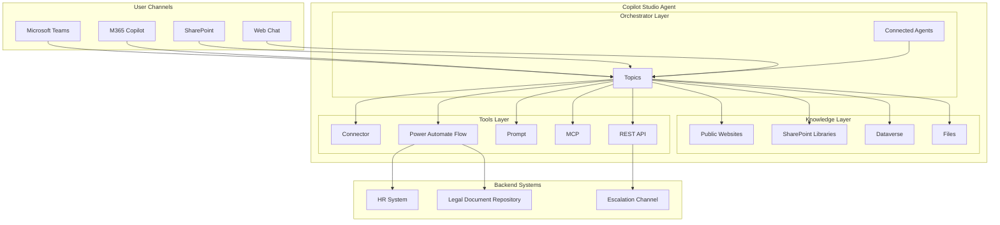
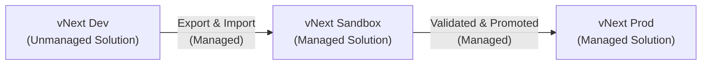
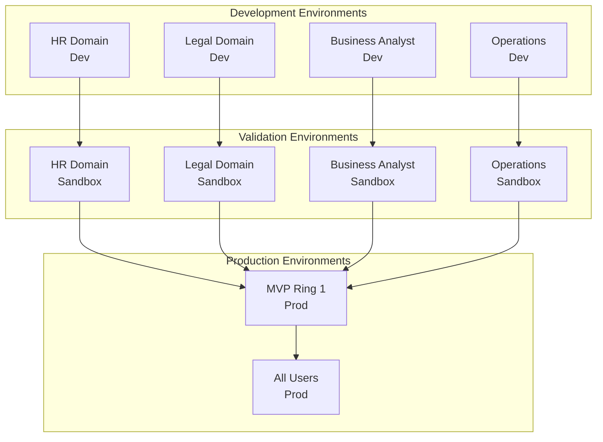
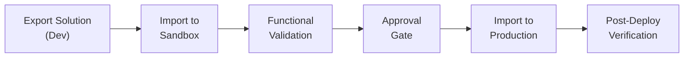

# Configuration Guide -- Policy Advisor Agent

A comprehensive reference for building and deploying a Policy Advisor agent in Microsoft Copilot Studio. This guide covers architecture, configuration, knowledge sources, publishing, and lifecycle management.

---

## Table of Contents

1. [Overview](#1-overview)
2. [Agent Layers](#2-agent-layers)
3. [Use Case Template](#3-use-case-template)
4. [Agent Creation](#4-agent-creation)
5. [Instructions Design](#5-instructions-design)
6. [Knowledge Configuration](#6-knowledge-configuration)
7. [Publishing and Polishing](#7-publishing-and-polishing)
8. [Agent Lifecycle Management](#8-agent-lifecycle-management)
9. [Build Pipeline](#9-build-pipeline)

---

## 1. Overview

### Purpose

The Policy Advisor agent assists employees by providing accurate, policy-compliant guidance on HR, Legal, and other company policies. It searches across internal knowledge sources, interprets the information, and delivers clear, actionable advice with verifiable citations.

### Target Users

| User Group | Use Case |
|------------|----------|
| All Employees | Self-service policy lookup, benefits questions, remote work eligibility |
| HR Staff | Validate policy interpretations, handle escalated inquiries |
| Legal Team | Compliance queries, regulatory guidance, contract policy questions |
| Managers | Team policy questions, accommodation requests, leave approvals |

### Architecture Overview



### Use Case Summary

| Attribute | Value |
|-----------|-------|
| Agent Name | Policy Advisor |
| Model | GPT-5 Chat |
| Primary Function | Policy-compliant guidance with citations |
| Knowledge Sources | Company website, SharePoint policy libraries |
| Channels | Microsoft Teams, M365 Copilot, SharePoint, Web Chat |
| Restrictions | Accessible to all standard employees |
| Primary Tool | Knowledge Retrieval |
| Environment | Labs/Dev (initial), then Sandbox and Production |

---

## 2. Agent Layers

The Policy Advisor agent follows the standard Copilot Studio three-layer architecture.

### Orchestrator Layer

The orchestrator manages conversation flow, routes user intent to the correct topic, and coordinates with connected agents when multi-domain expertise is required.

| Component | Description |
|-----------|-------------|
| **Topics** | Defined conversation paths for specific policy domains (HR, Legal, Benefits, etc.) |
| **Connected Agents** | Optional integration with domain-specific agents (e.g., a Benefits Calculator agent) |

### Knowledge Layer

The knowledge layer provides the information foundation for the agent. All responses are grounded in these sources.

| Source Type | Description | Example |
|-------------|-------------|---------|
| **Public Websites** | Company-facing policy pages | `https://company.example.com/policies` |
| **SharePoint** | Internal document libraries for HR, Legal, and Operations policies | Policy library site collections |
| **Dataverse** | Structured policy metadata, FAQ tables, escalation records | Policy tracking tables |
| **Files** | Uploaded policy documents (PDF, Word) | Employee handbook, benefits guide |

### Tools Layer

Tools extend the agent's capabilities beyond knowledge retrieval.

| Tool | Purpose |
|------|---------|
| **Connector** | Connect to external systems (HRIS, legal databases) |
| **Power Automate Flow** | Trigger workflows (escalation notifications, form submissions) |
| **Prompt** | Custom prompt templates for specialized policy interpretation |
| **MCP** | Model Context Protocol for advanced integrations |
| **REST API** | Direct API calls to backend policy management systems |

---

## 3. Use Case Template

### Blank Template

Use this template when defining a new policy advisor use case.

| Field | Value |
|-------|-------|
| Knowledge and Data Sources | |
| Topics | |
| Restrictions | |
| Tools | |
| Environment | |
| Actions / Flows / Triggers | |
| Analytics and Evals | |

### Filled Template -- Policy Advisor

| Field | Value |
|-------|-------|
| Knowledge and Data Sources | Company website (`https://company.example.com`) + SharePoint policy libraries |
| Topics | Policy Inquiry, Workplace Accommodations, HR Policy Lookup, Legal Compliance, Benefits and Leave |
| Restrictions | Accessible to all standard employees |
| Tools | Knowledge Retrieval (primary) |
| Environment | Labs/Dev environment |
| Actions / Flows / Triggers | Knowledge Retrieval |
| Analytics and Evals | TBD -- configure after initial deployment |

---

## 4. Agent Creation

### Step 1: Access Copilot Studio

1. Navigate to [https://copilotstudio.microsoft.com](https://copilotstudio.microsoft.com).
2. Select the target Dataverse environment (Dev environment for initial build).
3. Confirm your account has the **Copilot Studio Maker** role.

### Step 2: Create a New Agent

1. Click **Create** from the left navigation.
2. Select **New agent**.
3. Configure the agent basics:
   - **Name**: Policy Advisor
   - **Description**: Assists employees with accurate, policy-compliant guidance on HR, Legal, and company policies.
   - **Language**: English
   - **Icon**: Upload a professional icon (scales of justice, policy book, or similar).

### Step 3: Configure the Model

1. Navigate to **Settings** > **Generative AI**.
2. Select **GPT-5 Chat** as the model.
3. Enable **Classic and Generative** mode to support both structured topics and generative answers.

### Step 4: Set Agent Instructions

1. Navigate to the agent overview page.
2. Paste the V1 instructions (see Section 5 below) into the **Instructions** field.
3. Save and test with sample queries to validate behavior.

### Step 5: Add Knowledge Sources

1. Follow the knowledge configuration steps in Section 6.
2. Validate each source returns relevant results before proceeding.

### Step 6: Define Topics

1. Create topics as defined in the agent template (`templates/agent-template.yaml`).
2. Configure trigger phrases, entity extraction, and response templates for each topic.
3. Test each topic individually before enabling generative orchestration.

---

## 5. Instructions Design

### V1 Instructions

These instructions define the agent's behavior, tone, and step-by-step response pattern. Paste this block into the Copilot Studio **Instructions** field.

```
# Purpose
The agent's purpose is to assist employees by providing accurate, policy-compliant
guidance on HR, Legal, and other company policies. It should search across internal
knowledge sources, interpret the information, and deliver clear, actionable advice
with verifiable citations.

# General Guidelines
- Maintain a professional and supportive tone.
- Always provide responses based on the most recent and authoritative policy documents.
- Include citations or references to the source of information whenever possible.
- If the answer is uncertain or incomplete, clearly state limitations and suggest
  escalation or next steps.

# Skills
- Ability to search and retrieve relevant policy documents from knowledge sources.
- Summarize and interpret policy language into clear, actionable guidance.
- Provide next steps or recommendations based on the policy context.

# Step-by-Step Instructions

## 1. Identify the User's Request
- Goal: Understand the user's question or issue.
- Action: Ask clarifying questions if the request is ambiguous.
- Transition: Once the request is clear, proceed to search for relevant policies.

## 2. Search Knowledge Sources
- Goal: Find the most relevant HR, Legal, or company policy documents.
- Action: Use internal knowledge sources such as SharePoint, HR policy repositories,
  or legal compliance documents.
- Transition: After retrieving relevant documents, analyze the content.

## 3. Analyze and Summarize
- Goal: Interpret the policy language and extract key points.
- Action: Summarize the relevant sections in plain language while maintaining accuracy.
- Transition: Prepare a response that includes guidance and citations.

## 4. Provide Guidance and Next Steps
- Goal: Deliver a clear, actionable response.
- Action: Include:
  - A concise summary of the policy.
  - Verifiable citations (document name, section, or link).
  - Suggested next steps (e.g., contact HR, submit a form, escalate to Legal).
- Transition: Offer to assist with related questions or provide additional resources.

# Error Handling and Limitations
- If no relevant policy is found, inform the user and suggest contacting HR or Legal.
- If the policy is outdated or unclear, note this and recommend escalation.

# Feedback and Iteration
- Ask the user if the provided information resolves their query.
- Offer to refine the search or provide additional details if needed.

# Interaction Example
User: "What is the company's policy on remote work?"
Agent: "According to the Remote Work Policy (Section 3, updated Jan 2024), employees
may work remotely up to 3 days per week with manager approval. [Link to policy].
Next steps: Confirm with your manager and submit a remote work request form via the
HR portal. Would you like me to provide the form link?"
```

### Micro-Stepping Pattern

The instructions above follow a **micro-stepping** pattern where each step has three components:

| Component | Purpose |
|-----------|---------|
| **Goal** | What this step aims to accomplish |
| **Action** | The specific behavior the agent should perform |
| **Transition** | How the agent moves to the next step |

This pattern produces consistent, predictable agent behavior and makes debugging straightforward.

### Guidelines for Writing Good Instructions

1. **Be explicit about tone** -- State the expected communication style (professional, supportive, formal).
2. **Define the search-first pattern** -- Always instruct the agent to search knowledge sources before generating answers.
3. **Require citations** -- Mandate that every policy answer includes a source reference.
4. **Handle uncertainty gracefully** -- Include explicit fallback behavior when no policy is found.
5. **Include an interaction example** -- Provide at least one concrete example of the expected input/output.
6. **Use structured steps** -- Break complex workflows into numbered, sequential steps.
7. **Define escalation paths** -- Specify when and how the agent should hand off to a human.
8. **Iterate based on testing** -- V1 instructions are a starting point; refine based on user testing and analytics.

---

## 6. Knowledge Configuration

### Public Website

| Setting | Value |
|---------|-------|
| Source Type | Public website |
| URL | `https://company.example.com` |
| Description | Corporate policy website containing published HR, Legal, and operational policies accessible to all employees. |
| Crawl Depth | Default |

NOTE: Write a meaningful description for each knowledge source. Auto-generated descriptions reduce retrieval accuracy. A good description tells the agent what kind of information it can find in this source.

### SharePoint Libraries

Configure one or more SharePoint document libraries as knowledge sources.

| Library | Description | Example Content |
|---------|-------------|-----------------|
| HR Policy Library | Internal HR policies including employee handbook, compensation, benefits, leave, and workplace conduct. | Employee Handbook, PTO Policy, FMLA Guide |
| Legal Compliance Library | Legal and regulatory compliance documents including data privacy, corporate governance, and contractual policies. | Privacy Policy, Data Retention Policy, Code of Ethics |
| Operations Policy Library | Operational procedures including remote work, travel, procurement, and facility management. | Remote Work Policy, Travel Policy, Procurement Guidelines |

#### Adding a SharePoint Knowledge Source

1. Open the agent in Copilot Studio.
2. Navigate to **Knowledge** > **Add knowledge source**.
3. Select **SharePoint**.
4. Enter the SharePoint site URL or document library URL.
5. Write a descriptive summary of the content (see table above for examples).
6. Save and run a manual sync.
7. Test with a sample query to verify results are returned.

### Web Search

| Setting | Value |
|---------|-------|
| Enabled | Yes |
| Purpose | Supplement internal knowledge with publicly available policy guidance and regulatory references |

NOTE: Web search should supplement, not replace, internal knowledge sources. Internal policy documents are always the authoritative source.

### Knowledge Source Description Best Practices

| Practice | Example |
|----------|---------|
| Describe the content domain | "HR policies covering employee lifecycle from onboarding to separation" |
| Specify the document types | "PDF and Word documents including handbooks, guides, and policy memos" |
| Note the audience | "Policies applicable to all full-time and part-time employees" |
| Avoid auto-generated text | Do not accept default descriptions; write your own |
| Keep it concise but specific | 1-3 sentences that clearly scope the content |

---

## 7. Publishing and Polishing

Before publishing, complete the following 10-item checklist.

| # | Item | Description | Status |
|---|------|-------------|--------|
| 1 | **Agent Name** | Confirm the display name is "Policy Advisor" (or your organization's preferred name). | [ ] |
| 2 | **Channels** | Enable Microsoft Teams, M365 Copilot, and SharePoint channels. | [ ] |
| 3 | **Icon** | Upload a professional, recognizable icon (recommended: 96x96 PNG with transparent background). | [ ] |
| 4 | **Color** | Set the agent accent color to match your organization's brand guidelines. | [ ] |
| 5 | **Developer Name** | Enter the responsible team or individual (e.g., "Enterprise Platform Team"). | [ ] |
| 6 | **Website URL** | Set to your organization's website (e.g., `https://company.example.com`). | [ ] |
| 7 | **Privacy Statement URL** | Link to your organization's privacy statement. | [ ] |
| 8 | **Terms of Use URL** | Link to your organization's terms of use for internal tools. | [ ] |
| 9 | **Short Description** | Write a concise description (1-2 sentences) for the agent card. Example: "Get instant answers to HR, Legal, and company policy questions with cited sources." | [ ] |
| 10 | **Long Description** | Write a detailed description (3-5 sentences) explaining the agent's capabilities, supported topics, and how employees can use it. | [ ] |

### Publishing Steps

1. Complete all 10 items in the checklist above.
2. Navigate to **Publish** in Copilot Studio.
3. Review the publish summary for any warnings or errors.
4. Click **Publish** to make the agent available on configured channels.
5. For Microsoft Teams: submit for admin approval if required by your tenant policy.
6. For M365 Copilot: verify the agent appears in the Copilot extensions gallery.
7. For SharePoint: embed the agent web chat component on the target SharePoint pages.

---

## 8. Agent Lifecycle Management

### Three-Environment Pattern

The Policy Advisor follows a three-environment promotion model to ensure quality and governance.



#### Environment Details

| Environment | Solution Type | Editing | Purpose | Access |
|-------------|--------------|---------|---------|--------|
| **vNext Dev** | Unmanaged | Multiple authors can edit | Active development, topic authoring, knowledge tuning | Agent makers and developers |
| **vNext Sandbox** | Managed | No solution editing | Functional validation, integration testing, UAT | Minimal user access for testing |
| **vNext Prod** | Managed | No editing, Managed Environment enabled | Production deployment serving all employees | All standard employees |

### Solution Naming

| Attribute | Value |
|-----------|-------|
| Solution Name | PolicyAdvisor |
| Version | 1.0.0.1 |
| Publisher | Enterprise Platform Team |

### Managed vs. Unmanaged Solutions

| Aspect | Unmanaged (Dev) | Managed (Sandbox/Prod) |
|--------|-----------------|----------------------|
| Editing | Full editing allowed | No direct editing |
| Deletion | Components can be deleted individually | Solution removed as a unit |
| Layering | Base layer | Managed layer on top of base |
| Use case | Active development | Deployment to higher environments |

### DLP and Governance

Production environments should enforce the following governance controls:

- **DLP Policies** -- Restrict connector usage to approved connectors only.
- **Managed Environments** -- Enable Managed Environment features for production.
- **Least Privileged Roles** -- Assign minimum required roles for each environment.
- **Solution Checker** -- Run solution checker before promoting to Sandbox.

### Environment Topology

For organizations with multiple policy domains, consider a domain-specific environment topology:



This topology allows each domain team (HR, Legal, Operations) to develop and validate independently, with a consolidated production ring for phased rollout.

---

## 9. Build Pipeline

### Pipeline Configuration

Configure the build pipeline through the Copilot Studio solutions page.

| Stage | Action | Validation |
|-------|--------|------------|
| **Export from Dev** | Export the PolicyAdvisor solution as managed | Solution checker passes with no critical errors |
| **Import to Sandbox** | Import the managed solution into the Sandbox environment | All components import successfully |
| **Functional Validation** | Execute test scenarios against the Sandbox agent | All test cases pass |
| **Promote to Production** | Import the managed solution into the Production environment | Smoke tests pass |
| **Post-Deployment** | Verify agent is available on all channels | End-to-end user flow confirmed |

### Deployment Stages



### Versioning Strategy

| Version Component | Convention | Example |
|-------------------|-----------|---------|
| Major | Breaking changes or significant feature additions | 2.0.0.0 |
| Minor | New topics, knowledge source additions | 1.1.0.0 |
| Build | Bug fixes, instruction refinements | 1.0.1.0 |
| Revision | Metadata or configuration-only changes | 1.0.0.2 |

Initial version: **1.0.0.1**

### Pipeline Best Practices

1. **Always export as managed** when promoting beyond Dev.
2. **Run solution checker** before every export.
3. **Tag each export** with the version number in source control.
4. **Document changes** in a changelog for each version.
5. **Use approval gates** between Sandbox and Production.
6. **Maintain a rollback plan** -- keep the previous managed solution version available for re-import.
7. **Test in Sandbox** with representative users before Production promotion.

---

## Appendix: Reference Links

| Resource | URL |
|----------|-----|
| Copilot Studio Documentation | https://learn.microsoft.com/microsoft-copilot-studio/ |
| Power Platform ALM Guide | https://learn.microsoft.com/power-platform/alm/ |
| Managed Environments | https://learn.microsoft.com/power-platform/admin/managed-environment-overview |
| DLP Policies | https://learn.microsoft.com/power-platform/admin/wp-data-loss-prevention |
| Solution Checker | https://learn.microsoft.com/power-apps/maker/data-platform/use-powerapps-checker |
